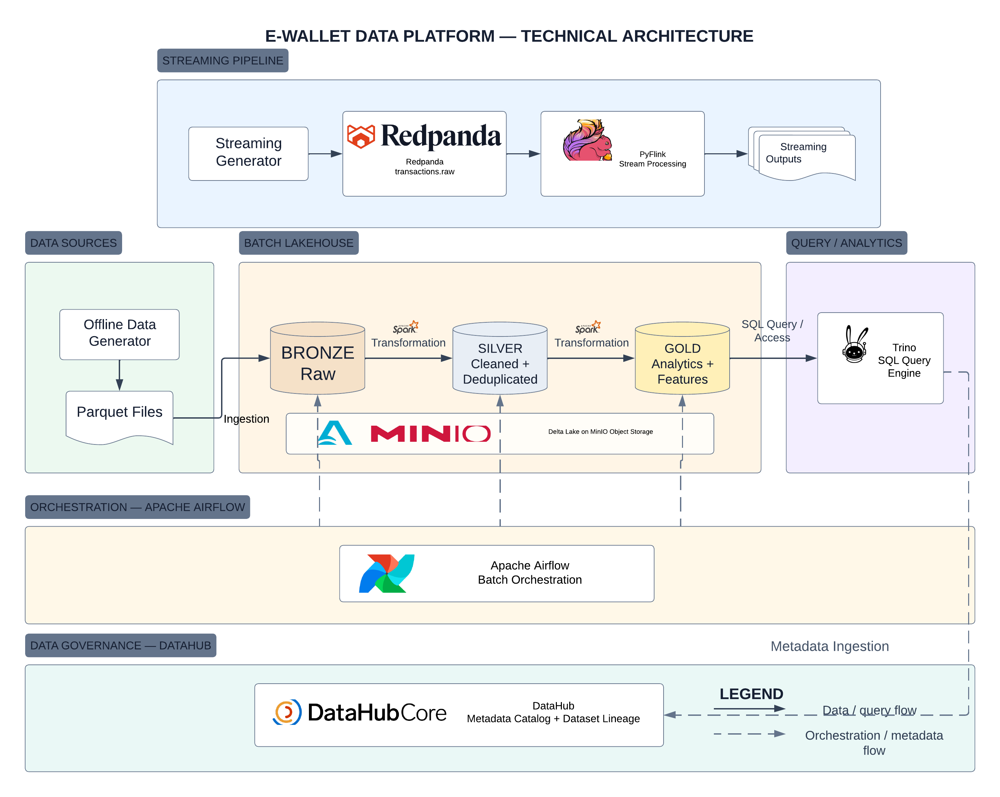

# E-Wallet Data Platform

An end-to-end **batch + streaming data platform** for synthetic e-wallet transactions, built as a mini-coursework project to demonstrate lakehouse design, distributed data processing, data quality, orchestration, metadata lineage, and performance optimization.

The platform is designed as the data foundation for a later **fraud detection** phase.

---

## Architecture



The platform contains two main data paths:

```text
Offline Data Generator
        ↓
     Parquet
        ↓
 Bronze Delta
        ↓ Spark
 Silver Delta
        ↓ Spark
  Gold Delta
        ↓
      Trino
```

```text
Streaming Generator
        ↓
     Redpanda
  transactions.raw
        ↓
      PyFlink
        ↓
 Streaming Outputs
```

Cross-cutting platform components:

- **Apache Airflow** orchestrates the batch pipeline and validation gates.
- **DataHub** provides metadata discovery and dataset lineage.
- **Delta Lake** provides the lakehouse table format.
- **MinIO** stores the underlying Delta Lake objects.
- **Trino** queries the Delta tables directly from the lakehouse.

---

## Technology Stack

| Area | Technology |
|---|---|
| Batch processing | Apache Spark / PySpark |
| Streaming processing | Apache Flink / PyFlink |
| Event streaming | Redpanda |
| Lakehouse format | Delta Lake |
| Object storage | MinIO |
| SQL query engine | Trino |
| Orchestration | Apache Airflow |
| Metadata & lineage | DataHub |
| Source format | Parquet |
| Local infrastructure | Docker / Docker Compose |

---

## Final Dataset

The final offline dataset is generated deterministically with `random_seed = 42`.

| Dataset | Rows |
|---|---:|
| Users | 500,000 |
| Accounts | 500,000 |
| Merchants | 300 |
| Devices | 500,000 |
| Bronze transactions | 4,080,000 |
| Silver transactions after deduplication | 4,000,000 |
| Balance snapshots | 3,895,224 |
| Login events | 3,997,362 |

The generator intentionally creates several engineering challenges:

- duplicated transactions
- merchant-key skew
- schema evolution
- high-cardinality identifiers
- streaming duplicates
- late-arriving streaming events
- burst traffic

---

## Batch Lakehouse Pipeline

The offline pipeline follows a Bronze → Silver → Gold architecture.

### Bronze

Bronze preserves ingested source data in Delta Lake.

```text
Parquet source
    ↓
Bronze Delta tables
```

The main Bronze transaction table contains **4,080,000 rows**, including intentional offline duplicates.

Transaction schema evolution is demonstrated using two physical source versions:

```text
transactions_v1.parquet
899,818 rows
channel column absent

        ↓ schema evolution

transactions_v2.parquet
3,180,182 rows
channel column present
```

After schema merging, the Bronze Delta table exposes a unified schema:

- V1 rows keep `channel = NULL`
- V2 rows contain the `channel` field

### Silver

Silver performs data cleaning and standardization.

Main responsibilities include:

- schema casting
- transaction deduplication
- business validation
- channel normalization
- date derivation

Transaction deduplication keeps the latest record by `ingested_at` for each `transaction_id`.

```text
Bronze transactions: 4,080,000
Silver transactions: 4,000,000
Duplicates removed:     80,000
```

### Gold

Gold contains business-ready analytical datasets.

Implemented Gold datasets include:

```text
Dimensions
├── dim_user
├── dim_account
├── dim_merchant
├── dim_device
└── dim_date

Facts
├── fact_transactions
├── fact_login_events
└── fact_balance_snapshot

OBT
└── obt_transaction_enriched

Features
└── feat_user_90d

Analytics
└── opt_merchant_performance
```

`fact_transactions` is partitioned by `event_date`.

---

## Streaming Pipeline

The real-time path is implemented with Redpanda and PyFlink.

```text
Streaming Generator
        ↓
Redpanda topic: transactions.raw
        ↓
PyFlink
        ↓
Streaming Outputs
```

The streaming job demonstrates:

- keyed stateful deduplication by `transaction_id`
- state TTL
- event-time processing
- watermarks
- late-event handling
- 5-minute tumbling windows
- per-user transaction count and total amount
- duplicate and late-event outputs

A separate burst monitor evaluates transaction volume using processing-time windows.

The final implementation produces logical output categories for:

```text
FEATURE
DUPLICATE
LATE
```

---

## Data Quality

Validation is implemented as explicit pipeline quality gates.

The Airflow DAG executes:

```text
bronze_ingestion
        ↓
validate_bronze
        ↓
silver_transformation
        ↓
validate_silver
        ↓
gold_transformation
        ↓
validate_gold
```

If a validation task fails, downstream processing does not continue.

Validation includes checks such as:

- non-empty datasets
- required key validation
- uniqueness checks
- transaction deduplication checks
- positive transaction amounts
- non-negative balances
- valid transaction type/status
- cross-layer row-count contracts
- fact / OBT row-count consistency

---

## Airflow Orchestration

Apache Airflow orchestrates the batch pipeline while transformation logic remains inside the existing pipeline scripts.

Final configuration:

```text
Executor: LocalExecutor
Schedule: daily
Catchup: disabled
Retries: 2
Retry delay: 2 minutes
max_active_runs: 1
max_active_tasks: 1
```

The concurrency limits prevent multiple local Spark workloads from running simultaneously on the coursework machine.

Final 500k-user DAG run:

```text
Tasks:    6 / 6 successful
Runtime:  18 minutes 08 seconds
```

---

## DataHub Metadata & Lineage

DataHub is used as the metadata catalog and lineage layer.

Metadata is ingested from the Trino `delta` catalog.

The demonstrated transaction lineage is:

```text
bronze_zone.transactions
        ↓
silver_zone.transactions
        ↓
gold_zone.fact_transactions
        ↓
gold_zone.obt_transaction_enriched
        ↓
gold_zone.feat_user_90d
```

Lineage edges are registered explicitly through the DataHub Python SDK.

DataHub stores metadata and lineage information only; the actual transaction data remains in Delta Lake on MinIO.

---

## Storage Optimization

The Gold transaction fact initially exhibited a severe small-file problem.

### Before compaction

| Metric | Value |
|---|---:|
| Daily partitions | 151 |
| Active files | 2,188 |
| Active data size | 760.76 MiB |
| Average file size | 0.35 MiB |
| Files scanned for 7-day query | 102 |
| Data scanned for 7-day query | 35.46 MiB |
| Median query runtime | 0.2190 s |

The table was compacted with Trino:

```sql
ALTER TABLE delta.gold_zone.fact_transactions
EXECUTE optimize(file_size_threshold => '16MB');
```

### After compaction

| Metric | Value |
|---|---:|
| Daily partitions | 151 |
| Active files | 151 |
| Active data size | 404.12 MiB |
| Average file size | 2.68 MiB |
| Files scanned for 7-day query | 7 |
| Data scanned for 7-day query | 18.73 MiB |
| Median query runtime | 0.1079 s |

Results:

- active files reduced by approximately **93.10%**
- median query runtime reduced by approximately **50.73%**
- observed median speedup: approximately **2.03x**

No `VACUUM` operation was performed so Delta history remains available.

---

## Spark Performance Benchmarks

### Merchant-key skew

The generator intentionally routes approximately 80% of merchant traffic to the top 5% of merchants.

Final observed skew:

```text
Merchant transactions:     1,598,383
Distinct merchants:        300
Top 5% merchants:          15
Top 5% transaction share:  80.02%
Max / median ratio:        76.12
```

The workload compares:

```text
Baseline
AQE OFF
Skew Join OFF
```

against:

```text
Optimized
AQE ON
Skew Join ON
```

Five-run comparison:

| Metric | Baseline | AQE Optimized |
|---|---:|---:|
| Median runtime | 13.3611 s | 13.6310 s |
| Average runtime | 13.5166 s | 13.2560 s |
| Minimum runtime | 12.9129 s | 12.3631 s |
| Maximum runtime | 14.2393 s | 13.8842 s |

The difference was small and inconsistent, so **no significant performance improvement** was observed.

The workload aggregates by `merchant_id` before the join, substantially reducing the amount of skewed data reaching the join stage.

### High cardinality

`transaction_id` contains 4,000,000 unique values after Silver deduplication.

| Metric | Exact | Approximate |
|---|---:|---:|
| Distinct count | 4,000,000 | 4,075,598 |
| Median runtime | 15.1544 s | 13.1332 s |
| Average runtime | 15.1650 s | 13.3215 s |
| Minimum runtime | 14.8369 s | 12.3589 s |
| Maximum runtime | 15.7648 s | 14.0740 s |

`approx_count_distinct(..., 0.05)` reduced median runtime by approximately **13.34%** with an observed relative error of approximately **1.89%**.

---

## Repository Structure

```text
ewallet-data-ai-platform/
├── data_generator/
│   ├── config/
│   ├── src/
│   └── output/
├── transformation/
│   └── spark/
├── storage/
│   └── scripts/
├── orchestration/
│   └── airflow/
│       └── dags/
├── lineage/
├── docs/
│   ├── evidence/
│   │   ├── architecture/
│   │   ├── airflow/
│   │   ├── datahub/
│   │   ├── flink/
│   │   ├── spark/
│   │   └── storage/
│   ├── 01_data_generator.md
│   ├── 02_schema_design_example.md
│   ├── 03_batch_pipeline.md
│   ├── 04_streaming_pipeline.md
│   ├── 05_storage_optimization.md
│   ├── 06_airflow_orchestration.md
│   ├── 07_performance_benchmarks.md
│   └── 08_datahub_lineage.md
└── README.md
```

Generated datasets, logs, caches, Airflow runtime files, and other large runtime artifacts are excluded from Git.

---

## Running the Project

### 1. Generate offline data

From the project root:

```bash
python -m data_generator.src.offline.offline_generator
```

Generated source files are written under:

```text
data_generator/output/offline
```

### 2. Initialize Bronze storage

Start the required local services first, then run:

```bash
python storage/scripts/init_storage.py
```

This initializes MinIO buckets, registers the Trino schemas/tables, writes Bronze Delta tables, and verifies row counts.

### 3. Run the batch pipeline with Airflow

Set the local Airflow home:

```bash
export AIRFLOW_HOME="$(pwd)/orchestration/airflow"
airflow standalone
```

The DAG orchestrates:

```text
Bronze → Validate → Silver → Validate → Gold → Validate
```

### 4. Query the lakehouse

Example Trino query:

```sql
SELECT COUNT(*)
FROM delta.gold_zone.fact_transactions;
```

---

## Documentation

Detailed implementation notes and evidence are available in:

| Document | Description |
|---|---|
| [`docs/01_data_generator.md`](docs/01_data_generator.md) | Synthetic data generation and data issues |
| [`docs/02_schema_design_example.md`](docs/02_schema_design_example.md) | Gold schema and platform design |
| [`docs/03_batch_pipeline.md`](docs/03_batch_pipeline.md) | Bronze, Silver and Gold batch processing |
| [`docs/04_streaming_pipeline.md`](docs/04_streaming_pipeline.md) | Redpanda + PyFlink streaming implementation |
| [`docs/05_storage_optimization.md`](docs/05_storage_optimization.md) | Delta small-file compaction benchmark |
| [`docs/06_airflow_orchestration.md`](docs/06_airflow_orchestration.md) | Airflow DAG, retries and validation gates |
| [`docs/07_performance_benchmarks.md`](docs/07_performance_benchmarks.md) | Spark skew and high-cardinality benchmarks |
| [`docs/08_datahub_lineage.md`](docs/08_datahub_lineage.md) | Metadata ingestion and dataset lineage |

---

## Key Engineering Outcomes

| Area | Result |
|---|---|
| Offline scale | 500,000 users / 4.08M Bronze transactions |
| Deduplication | 80,000 intentional duplicates removed |
| Schema evolution | V1 without `channel` → V2 with `channel` |
| Merchant skew | Top 5% merchants receive 80.02% of traffic |
| Storage compaction | 2,188 → 151 active files |
| Analytical query | 0.2190 s → 0.1079 s median runtime |
| High-cardinality aggregation | ~13.34% lower median runtime with approximate count |
| Streaming | Event time, watermark, deduplication, late events, 5-minute windows |
| Batch orchestration | 6/6 Airflow tasks completed successfully |
| Metadata | Bronze → Silver → Gold → OBT → Feature lineage in DataHub |

---

## Current Scope

This repository represents the **data-platform phase** of the coursework.

Implemented:

- batch lakehouse
- Spark transformations
- data quality validation
- storage optimization
- event streaming
- PyFlink stream processing
- Airflow orchestration
- Trino analytics
- DataHub metadata and lineage
- offline feature generation

Not claimed as part of the current implementation:

- production distributed cluster deployment
- CDC production pipeline
- exactly-once end-to-end guarantees
- online feature store
- model serving
- production MLOps platform

---

## Next Phase

The next phase extends this platform toward **fraud detection**.

```text
Gold / Offline Features
        +
Streaming Features
        ↓
Fraud Feature Engineering
        ↓
Model Training
        ↓
Fraud Detection
        ↓
Evaluation / Inference
```

The current mini-coursework serves as the data engineering foundation for the later Data + AI workflow.
