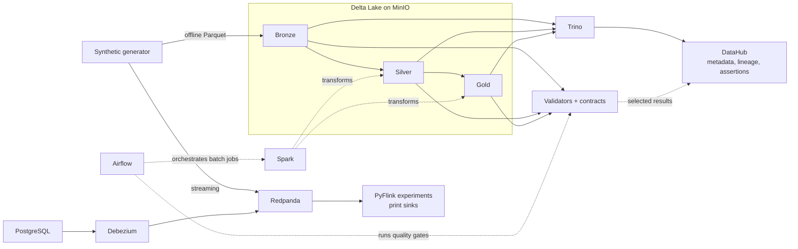

# E-Wallet Data & AI Platform

A local coursework platform for generating synthetic e-wallet data and
exploring ingestion, Delta Lake processing, streaming and CDC, analytics, data
quality, orchestration, contracts, metadata, lineage, and offline features. It
is the data-platform foundation for a later fraud-detection phase; it is not an
end-user wallet application.

## Architecture


```mermaid
flowchart LR
    GEN["Synthetic generator"]
    PG["PostgreSQL"]
    DBZ["Debezium"]
    RP["Redpanda"]
    FLINK["PyFlink experiments<br/>print sinks"]

    subgraph MINIO["Delta Lake on MinIO"]
        BR["Bronze"] --> SI["Silver"] --> GO["Gold"]
    end

    SPARK["Spark"]
    TRINO["Trino"]
    DQ["Validators + contracts"]
    AIRFLOW["Airflow"]
    DATAHUB["DataHub<br/>metadata, lineage, assertions"]

    GEN -->|offline Parquet| BR
    GEN -->|streaming| RP --> FLINK
    PG --> DBZ --> RP
    SPARK -.transforms.-> SI
    SPARK -.transforms.-> GO
    BR --> TRINO
    SI --> TRINO
    GO --> TRINO
    BR --> DQ
    SI --> DQ
    GO --> DQ
    TRINO --> DATAHUB
    DQ -.selected results.-> DATAHUB
    AIRFLOW -.orchestrates batch jobs.-> SPARK
    AIRFLOW -.runs quality gates.-> DQ
```

The batch path is implemented and validated. The PyFlink and CDC paths are
experiments: they publish/consume Redpanda events but do not persist streaming
results into the lakehouse. See the
[system architecture](docs/00_system_architecture.md) for data flow, component
status, ports, and limitations.

## What is implemented

| Area | Current state |
|---|---|
| Offline generation | Seven deterministic synthetic datasets with duplicates, skew, and schema evolution |
| Lakehouse | Bronze, Silver, and Gold Delta tables on MinIO |
| Batch processing | Spark transformations and independent fail-hard validators |
| Analytics | Trino over registered Delta locations |
| Orchestration | Daily Airflow DAG with serialized local Spark work |
| Governance | Four YAML contracts; DataHub metadata, 10 direct lineage edges, and 8 selected assertions |
| Messaging and CDC | Redpanda plus PostgreSQL/Debezium local experiment |
| Streaming | PyFlink deduplication, watermarks, windows, late events, and burst detection with print sinks |

The generated 500,000-user run produced 4.08 million Bronze transaction rows,
including 80,000 intentional duplicates. These are recorded run results, not
hard-coded pipeline expectations. Validators and the demo query current data.

## Repository map

```text
ewallet-data-ai-platform/
├── data_platform/
│   ├── generation/            # Offline and streaming synthetic generators
│   ├── ingestion/             # Debezium connector and Redpanda topic helper
│   ├── processing/
│   │   ├── spark/             # Silver and Gold batch transformations
│   │   └── flink/             # Experimental streaming jobs
│   ├── storage/               # MinIO, Delta, Trino config and registration
│   ├── orchestration/         # Airflow batch DAG
│   ├── quality/               # Bronze, Silver, and Gold validators
│   ├── contracts/             # Selected versioned dataset interfaces
│   └── metadata/datahub/
│       ├── assertions/        # Eight selected DQ assertions
│       ├── lineage/           # Trino recipe and direct lineage publisher
│       └── runtime/           # Pinned Quickstart helper
├── infra/docker/              # Canonical split Compose files
├── docs/                      # Architecture, component docs, and evidence
├── notebooks/                 # Read-only validation and coursework demos
└── tests/                     # Repository-level tests
```

The planned Phase 2 `ai_platform/` domains (`ml`, `llm`, `agents`, and
`serving`) are documented but are not created until implementation begins.

## Prerequisites

Run commands from the repository root. The local setup expects:

- Docker Engine and Docker Compose v2;
- Python 3.10+;
- `curl` and `sha256sum` for the pinned DataHub runtime helper;
- a project Python environment with the dependencies already used by the
  generator, PySpark/Delta, MinIO, and Trino scripts;
- Java compatible with the installed Spark/PyFlink versions;
- Jupyter for the notebook demo;
- a separate Python environment with `acryl-datahub==1.7.0.5` for DataHub
  operations.

This coursework repository does not yet provide a single locked Python
environment file. Use the same environment consistently for generation,
Spark, validation, and storage scripts. DataHub has a separate tested runtime
because its SDK dependency set is independent.

## Quickstart: platform infrastructure

The canonical stack is one Compose project assembled from four files. Always
keep the project name and project directory so services share DNS and the
existing persisted volumes.

Validate the merged configuration:

```bash
docker compose \
  -p ewallet-data-ai-platform \
  --project-directory . \
  --profile ingestion \
  --profile storage \
  -f infra/docker/compose.messaging.yml \
  -f infra/docker/compose.ingestion.yml \
  -f infra/docker/compose.storage.yml \
  -f infra/docker/compose.query.yml \
  config
```

Start it:

```bash
docker compose \
  -p ewallet-data-ai-platform \
  --project-directory . \
  --profile ingestion \
  --profile storage \
  -f infra/docker/compose.messaging.yml \
  -f infra/docker/compose.ingestion.yml \
  -f infra/docker/compose.storage.yml \
  -f infra/docker/compose.query.yml \
  up -d
```

Check service state and core query access:

```bash
docker compose \
  -p ewallet-data-ai-platform \
  --project-directory . \
  --profile ingestion \
  --profile storage \
  -f infra/docker/compose.messaging.yml \
  -f infra/docker/compose.ingestion.yml \
  -f infra/docker/compose.storage.yml \
  -f infra/docker/compose.query.yml \
  ps

docker exec trino trino --execute 'SELECT 1'
curl --fail http://localhost:9000/minio/health/ready
```

Partial stacks must include their dependencies.

Messaging plus ingestion:

```bash
docker compose \
  -p ewallet-data-ai-platform \
  --project-directory . \
  --profile ingestion \
  -f infra/docker/compose.messaging.yml \
  -f infra/docker/compose.ingestion.yml \
  up -d
```

Storage plus query:

```bash
docker compose \
  -p ewallet-data-ai-platform \
  --project-directory . \
  --profile storage \
  -f infra/docker/compose.storage.yml \
  -f infra/docker/compose.query.yml \
  up -d
```

Do not run ingestion without messaging or query without storage. Do not use
`docker compose down -v` when retaining local data. The former root
`docker-compose.yml` was removed after the split configuration passed
equivalence and runtime checks; it remains available at the `phase1-freeze`
tag.

## Batch pipeline

Generate offline source files:

```bash
python -m data_platform.generation.src.offline.offline_generator
```

Initialize persisted Bronze Delta tables:

```bash
python -m data_platform.storage.scripts.init_storage
python -m data_platform.quality.validate_bronze
```

Run the remaining stages directly when Airflow is not needed:

```bash
python -m data_platform.processing.spark.silver.silver_pipeline
python -m data_platform.quality.validate_silver
python -m data_platform.processing.spark.gold.gold_pipeline
python -m data_platform.quality.validate_gold
```

The Airflow DAG runs the full sequence with validation gates:

```text
Bronze ingestion -> Bronze validation -> Silver transformation
-> Silver validation -> Gold transformation -> Gold validation
```

Configure the two variables used by the DAG and start Airflow with the project
Airflow home:

```bash
export AIRFLOW_HOME="$(pwd)/data_platform/orchestration/airflow"
airflow variables set project_root "$(pwd)"
airflow variables set fintech_python "$(command -v python)"
airflow standalone
```

DataHub GMS owns local port `8080`, which is also Airflow's documented default.
Do not run both UIs on `8080`; stop one runtime or configure a supported
alternate Airflow host port for the installed Airflow version. The repository
does not silently choose that port.

## Lakehouse layers and validation

- **Bronze** preserves raw duplicates and schema-evolution nulls. Its validator
  verifies all seven persisted tables can be scanned and have required schemas.
- **Silver** casts, cleans, deduplicates, normalizes `channel`, and enforces
  required fields, domains, ranges, logical keys, and foreign keys.
- **Gold** builds dimensions, facts, the transaction OBT, 90-day user features,
  and merchant analytics; its validator enforces grains, relationships, ranges,
  and cross-layer populations.

All validators return a non-zero exit code on validation or runtime failure.
They read persisted Delta data and do not repair it.

Four contracts describe selected stable interfaces:

- [`silver.transactions`](data_platform/contracts/silver_transactions.yml)
- [`gold.fact_transactions`](data_platform/contracts/gold_fact_transactions.yml)
- [`gold.obt_transaction_enriched`](data_platform/contracts/gold_obt_transaction_enriched.yml)
- [`gold.feat_user_90d`](data_platform/contracts/gold_feat_user_90d.yml)

The contracts describe transformation behavior, the validators enforce the
full executable rule set, and DataHub exposes eight representative results.
See [`data_platform/contracts/README.md`](data_platform/contracts/README.md) for syntax validation.

## Register and query Delta tables with Trino

After Spark creates the Delta tables, register or verify all layers:

```bash
python3 -m data_platform.storage.scripts.register_trino_tables --layer all
```

This command is metadata-only and idempotent. It requires existing Delta logs,
checks readable locations, and fails on a location mismatch. It does not copy,
transform, drop, or re-point data.

Inspect and query the catalog:

```sql
SHOW SCHEMAS FROM delta;
SHOW TABLES FROM delta.bronze_zone;
SHOW TABLES FROM delta.silver_zone;
SHOW TABLES FROM delta.gold_zone;

SELECT status, count(*) AS transaction_count
FROM delta.gold_zone.fact_transactions
GROUP BY status
ORDER BY transaction_count DESC;
```

Use the Trino CLI inside the running container:

```bash
docker exec -it trino trino
```

## DataHub runtime and metadata

DataHub is intentionally separate from the main Compose project. The
repository helper downloads the official pinned Quickstart Compose Git ref
`v1.7.0.1`, verifies its checksum, and produces a deterministic runtime
Compose file with only the
external Kafka listener moved from `9092` to `9093`. The tested server image is
`v1.7.0.1`; the tested CLI/SDK is `1.7.0.5`.

Select the Python interpreter containing `acryl-datahub==1.7.0.5`:

```bash
export DATAHUB_PYTHON=/path/to/datahub-environment/bin/python
```

Start and check DataHub:

```bash
./data_platform/metadata/datahub/runtime/start_datahub.sh start
./data_platform/metadata/datahub/runtime/start_datahub.sh check
curl --fail http://localhost:8080/config
```

Stop containers while preserving Quickstart volumes:

```bash
./data_platform/metadata/datahub/runtime/start_datahub.sh stop
```

After Trino registration, ingest table metadata and publish direct lineage:

```bash
DATAHUB_TELEMETRY_ENABLED=false \
  "$DATAHUB_PYTHON" -m datahub ingest \
  -c data_platform/metadata/datahub/lineage/trino_recipe.yml

DATAHUB_TELEMETRY_ENABLED=false \
  "$DATAHUB_PYTHON" data_platform/metadata/datahub/lineage/create_lineage.py
```

Evaluate assertion logic without DataHub writes, then publish when GMS and the
target datasets are available:

```bash
DATAHUB_TELEMETRY_ENABLED=false \
  "$DATAHUB_PYTHON" data_platform/metadata/datahub/assertions/publish_assertions.py --self-test

DATAHUB_TELEMETRY_ENABLED=false \
  "$DATAHUB_PYTHON" data_platform/metadata/datahub/assertions/publish_assertions.py --dry-run

DATAHUB_TELEMETRY_ENABLED=false \
  "$DATAHUB_PYTHON" data_platform/metadata/datahub/assertions/publish_assertions.py --publish
```

The publisher uses deterministic assertion URNs. Re-running it updates the same
eight logical definitions and adds timestamped run results. Airflow does not
currently run Trino registration or DataHub publication.

## Streaming and CDC experiments

The streaming generator publishes synthetic events to
`transactions.raw` on Redpanda:

```bash
bash data_platform/ingestion/kafka/create_topic.sh
python -m data_platform.generation.src.streaming.streaming_generator
python -m data_platform.processing.flink.streaming_pipeline
```

The PyFlink job prints feature, duplicate, and late-event outputs. The separate
`data_platform/processing/flink/burst_monitor.py` prints processing-time burst metrics.
Neither job has a persistent sink.

The Debezium connector watches PostgreSQL `public.transactions` and publishes
CDC records with prefix `ewallet`; its table topic is
`ewallet.public.transactions`. CDC is not wired into Bronze/Silver/Gold.

## Demo notebook

[`notebooks/final_coursework_demo.ipynb`](notebooks/final_coursework_demo.ipynb)
is a read-only walkthrough. It checks endpoints, inventories the three Trino
schemas, reads current layer counts, runs sample analytics and selected quality
queries, displays contract summaries, and optionally checks DataHub.

Run it from the repository root:

```bash
jupyter notebook notebooks/final_coursework_demo.ipynb
```

For a non-interactive execution when `nbconvert` is available:

```bash
jupyter nbconvert \
  --execute \
  --to notebook \
  --inplace \
  notebooks/final_coursework_demo.ipynb
```

Defaults are `localhost:8081` for Trino, `localhost:9000` for MinIO, and
`localhost:8080` for DataHub. Override them with `TRINO_HOST`, `TRINO_PORT`,
`MINIO_URL`, and `DATAHUB_GMS_URL`. DataHub is optional for the core data demo.

## Port ownership

| Port | Component | Purpose |
|---:|---|---|
| 5432 | PostgreSQL | CDC source |
| 8080 | DataHub GMS | Metadata API |
| 8081 | Trino | SQL query API |
| 8082 | Redpanda Console | Messaging UI |
| 8083 | Kafka Connect | Connector REST API |
| 9000 | MinIO | S3 API |
| 9001 | MinIO | Console |
| 9002 | DataHub UI | Catalog UI |
| 9092 | Redpanda | External Kafka listener |
| 9093 | DataHub Quickstart Kafka | External Kafka listener |
| 29092 | Redpanda | Internal Kafka listener, also host-published |
| 9644 | Redpanda | Admin API |

## Known limitations

- PyFlink and CDC do not persist into Delta Lake.
- Streaming has no end-to-end exactly-once claim.
- Synthetic balances are not complete double-entry accounting semantics.
- DataHub Quickstart is a separate local-development runtime.
- Selected DataHub assertions do not mirror every validator rule.
- Airflow and DataHub both default to host port `8080`.
- Local credentials are for coursework development only.
- Kafka Connect image-declared anonymous volumes remain technical debt.
- Python dependencies are not yet captured in one locked environment file.

## Documentation

| Document | Purpose |
|---|---|
| [`docs/README.md`](docs/README.md) | Documentation navigation |
| [`docs/00_system_architecture.md`](docs/00_system_architecture.md) | Canonical architecture and implementation status |
| [`docs/01_data_generator.md`](docs/01_data_generator.md) | Synthetic generator behavior |
| [`docs/02_schema_design_example.md`](docs/02_schema_design_example.md) | Dataset schemas and Gold model |
| [`docs/03_batch_pipeline.md`](docs/03_batch_pipeline.md) | Bronze, Silver, and Gold processing |
| [`docs/04_streaming_pipeline.md`](docs/04_streaming_pipeline.md) | Experimental Redpanda/PyFlink path |
| [`docs/05_storage_optimization.md`](docs/05_storage_optimization.md) | Delta optimization benchmark |
| [`docs/06_airflow_orchestration.md`](docs/06_airflow_orchestration.md) | Airflow DAG and quality gates |
| [`docs/07_performance_benchmarks.md`](docs/07_performance_benchmarks.md) | Spark performance experiments |
| [`docs/08_datahub_lineage.md`](docs/08_datahub_lineage.md) | Metadata ingestion, lineage, and assertions |

The next task is the integrated final smoke test. This documentation task does
not regenerate the full dataset or run the complete end-to-end pipeline.
