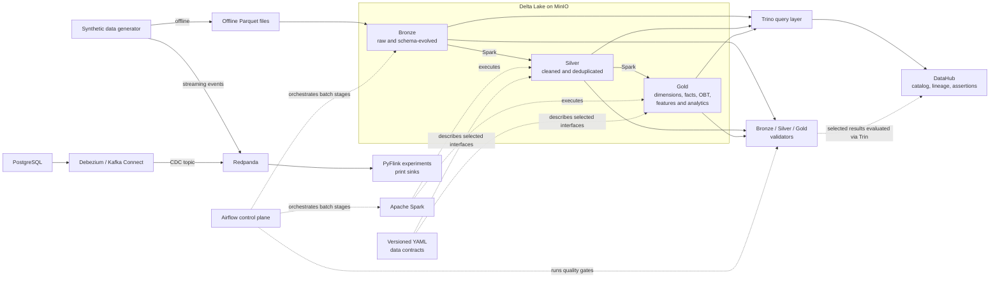
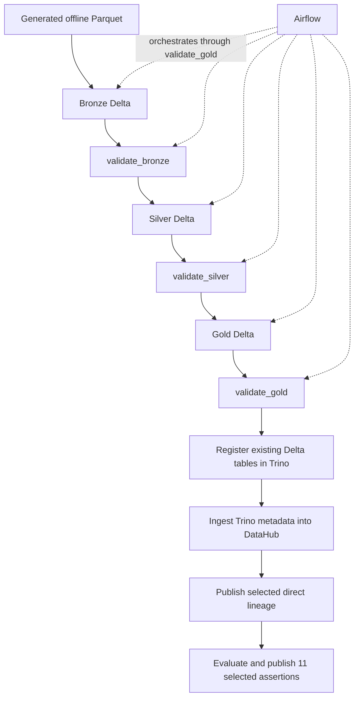

# System architecture

## Purpose

This repository is an E-Wallet Data & AI Platform coursework project. It
generates synthetic wallet data and demonstrates ingestion, lakehouse
processing, streaming and CDC experiments, analytics, quality enforcement,
metadata, lineage, and offline features. It is the data foundation for a later
fraud-detection phase; it is not an end-user wallet application.

## Repository domains

```text
ewallet-data-ai-platform/
├── data_platform/
│   ├── generation/
│   ├── ingestion/
│   ├── processing/
│   │   ├── spark/
│   │   └── flink/
│   ├── storage/
│   ├── orchestration/
│   ├── quality/
│   ├── contracts/
│   └── metadata/
├── infra/
│   └── docker/
├── notebooks/
├── docs/
└── tests/
```

Phase 2 plans reserve an `ai_platform/` domain for `ml`, `llm`, `agents`, and
`serving`. Those directories are not created until their first implementation
exists.

## Architecture at a glance



Solid arrows show data movement or query access. Dotted arrows show control,
execution, or documentation relationships. Airflow controls the batch jobs; it
does not store data. DataHub stores metadata and quality results; it does not
store wallet records.

## Batch and metadata flow



The current Airflow DAG stops after Gold validation. Trino registration and
DataHub publication are explicit post-pipeline operations.

## Layer responsibilities

### Bronze

- Ingests eight offline datasets into persisted Delta tables in MinIO.
- Preserves intentional transaction duplicates and historical nulls caused by
  schema evolution.
- Merges transaction V1, which has no `channel`, with V2, which adds it.
- Validates readability, required columns, compatible types, non-empty tables,
  and the final presence/type of `transactions.channel`.
- Preserves `fraud_labels` at one row per logical transaction while retaining
  intentional physical duplicates in `transactions`.

Bronze validation intentionally does not apply Silver business cleaning.

### Silver

- Casts and standardizes data.
- Deduplicates transactions by `transaction_id`.
- Normalizes historical missing channels to `UNKNOWN`.
- Enforces required fields, domains, ranges, logical keys, and foreign keys.
- Produces eight cleaned Delta tables, including trusted `fraud_labels` target
  truth without copying it into Gold.

### Gold

- Builds five dimensions: user, account, merchant, device, and date.
- Builds transaction, login-event, and balance-snapshot facts.
- Builds `obt_transaction_enriched` for flattened analytics.
- Builds `feat_user_90d` directly from `fact_transactions` and `dim_user`.
- Builds `opt_merchant_performance` for merchant analytics.
- Validates grain, relationships, metric ranges, and cross-layer populations.

### Trino

Trino is the SQL query surface over the Delta tables. Spark creates the data;
`data_platform/storage/scripts/register_trino_tables.py` only registers existing Delta
locations in the Trino metastore. It is metadata-only, idempotent, and fails if
an existing table points at the wrong location.

### Validators and contracts

The three validators are executable fail-hard gates. Their rules cover schema
and persisted readability at Bronze, cleaning and referential rules at Silver,
and analytical grains and population relationships at Gold.

The contracts under `data_platform/contracts/` describe five stable interfaces:

- `silver.transactions`
- `silver.fraud_labels`
- `gold.fact_transactions`
- `gold.obt_transaction_enriched`
- `gold.feat_user_90d`

The relationship is:

```text
transformation behavior -> data contract -> validator -> selected DataHub assertion
```

The eleven DataHub assertions are a visible subset of validator coverage. They
do not replace the full Silver and Gold validation suites.

### DataHub

DataHub runs as a separate pinned Quickstart stack. It ingests table metadata
from Trino, receives eleven explicit direct lineage edges for the selected
transaction and fraud-label paths, and stores eleven selected custom assertion
definitions and their run results. DataHub does not move or transform Delta
data.

### CDC and streaming

The CDC experiment captures `public.transactions` from PostgreSQL with the
Debezium connector and writes change events to Redpanda using topic prefix
`ewallet` (the table topic is `ewallet.public.transactions`). No CDC consumer
currently lands those events into Bronze, Silver, or Gold.

The separate synthetic streaming generator writes `transactions.raw` to
Redpanda. PyFlink demonstrates keyed deduplication with TTL, event-time
watermarks, late-event classification, five-minute user windows, and a burst
monitor. Its outputs use console print sinks; there is no persistent streaming
lakehouse sink or end-to-end exactly-once guarantee.

## Implementation status

| Component | Status | Source evidence |
|---|---|---|
| Offline synthetic generator | Implemented | `data_platform/generation/src/offline/offline_generator.py` |
| Bronze/Silver/Gold Delta lakehouse | Implemented and validated | `data_platform/storage/scripts/init_storage.py`, `data_platform/processing/spark/`, `data_platform/quality/` |
| MinIO and Trino | Implemented and locally smoke-tested | `infra/docker/compose.storage.yml`, `infra/docker/compose.query.yml` |
| Airflow batch orchestration | Implemented | `data_platform/orchestration/airflow/dags/ewallet_batch_pipeline.py` |
| Trino registration | Implemented and idempotent | `data_platform/storage/scripts/register_trino_tables.py` |
| Data contracts | Implemented for four selected datasets | `data_platform/contracts/` |
| DataHub metadata and selected lineage | Implemented and runtime-validated | `data_platform/metadata/datahub/lineage/` |
| DataHub selected assertions | Implemented; 8 definitions are idempotent | `data_platform/metadata/datahub/assertions/publish_assertions.py` |
| PostgreSQL/Debezium CDC | Implemented as a local experiment | `data_platform/ingestion/debezium/connector-config.json` |
| PyFlink stream processing | Experimental | `data_platform/processing/flink/streaming_pipeline.py`, print sinks only |
| Streaming/CDC lakehouse sink | Not implemented | No sink from Redpanda/Flink into Delta |
| Phase 2 fraud ML/LLM/agent work | Planned | Outside the current repository phase |

## Runtime boundaries and ports

The project infrastructure uses one Compose project assembled from four split
files. DataHub remains a separate Quickstart project.

| Port | Component | Purpose | Required for core batch demo? |
|---:|---|---|---|
| 5432 | PostgreSQL | CDC source database | No |
| 8080 | DataHub GMS | Metadata API | No |
| 8081 | Trino | Lakehouse SQL | Yes |
| 8082 | Redpanda Console | Messaging UI | No |
| 8083 | Kafka Connect | Connector REST API | No |
| 9000 | MinIO | S3-compatible API | Yes |
| 9001 | MinIO | Object-store console | No |
| 9002 | DataHub UI | Metadata catalog UI | No |
| 9092 | Redpanda | Host Kafka listener | No |
| 9093 | DataHub Quickstart Kafka | Host Kafka listener | No |
| 29092 | Redpanda | Internal listener, also published | No |
| 9644 | Redpanda | Admin API | No |

DataHub GMS and Airflow both default to host port `8080`. Run Airflow on a
different host port when both are active. The repository records this as a
known local configuration follow-up rather than silently changing Airflow.

## Known limitations

- The data is synthetic and is not a production double-entry ledger.
- Generated balances demonstrate data engineering behavior, not complete
  accounting chronology or reconciliation semantics.
- Flink outputs are ephemeral print sinks and do not feed the lakehouse.
- CDC events are published to Redpanda but are not consumed into Delta.
- DataHub Quickstart is a separate local-development runtime.
- The eleven DataHub assertions cover selected contract rules, not every
  validator rule.
- Local Compose files contain development credentials suitable only for the
  coursework environment.
- Kafka Connect image-declared anonymous volumes remain technical debt.
- Airflow needs a host-port override to coexist with DataHub GMS on `8080`.

Operational commands are kept in the root `README.md`; detailed component
documentation is indexed in `docs/README.md`.
