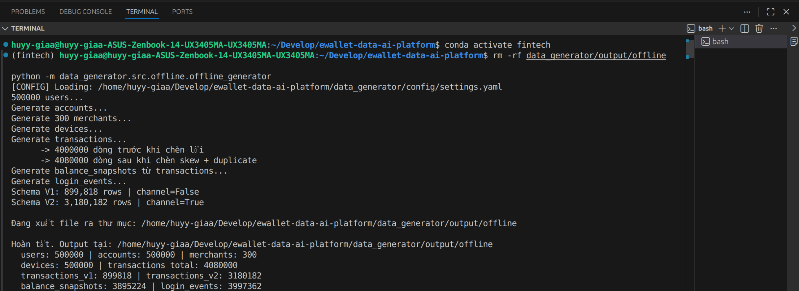

# Fintech E-Wallet Data Generator

## 1. Mục tiêu

Data Generator mô phỏng dữ liệu cho một nền tảng ví điện tử
(E-wallet) và cung cấp hai nguồn dữ liệu chính cho coursework:

```text
Offline
→ Parquet
→ Batch Pipeline

Streaming
→ JSON
→ Redpanda / Kafka-compatible topic
→ Flink
```

Generator không chỉ tạo dữ liệu hợp lệ mà còn cố tình đưa vào các
đặc điểm thường gặp trong hệ thống dữ liệu thực tế:

- Data skew
- High cardinality
- Duplicate records
- Schema evolution
- Streaming duplicates
- Late-arriving events
- Traffic bursts

Các vấn đề này được sử dụng ở các bước sau để kiểm thử ingestion,
transformation, streaming processing và performance optimization.

---

## 2. Offline Dataset Design

### 2.1 Logical Datasets

Generator tạo 7 logical datasets:

| Dataset | Grain | Key Columns |
|---|---|---|
| `users` | one row per user | `user_id`, `full_name`, `email`, `phone`, `kyc_verified`, `created_at` |
| `accounts` | one row per account | `account_id`, `user_id`, `account_type`, `currency`, `created_at` |
| `merchants` | one row per merchant | `merchant_id`, `merchant_name`, `category` |
| `devices` | one row per device | `device_id`, `user_id`, `device_type`, `os`, `first_seen_at` |
| `transactions` | one row per transaction event | `transaction_id`, `account_id`, `user_id`, `device_id`, `type`, `amount`, `currency`, `status`, `channel`, `old_balance`, `new_balance`, `merchant_id`, `counterparty_account_id`, `timestamp`, `ingested_at` |
| `balance_snapshots` | one row per account/day | `account_id`, `snapshot_date`, `closing_balance` |
| `login_events` | one row per login attempt | `login_id`, `user_id`, `device_id`, `login_ts`, `is_success` |

Although there are 7 logical datasets, the transaction source is
physically exported as two Parquet batches to demonstrate schema
evolution.

Therefore, the final offline output contains 8 physical Parquet files.

```text
data_generator/output/offline/
├── users.parquet
├── accounts.parquet
├── merchants.parquet
├── devices.parquet
├── transactions_v1.parquet
├── transactions_v2.parquet
├── balance_snapshots.parquet
└── login_events.parquet
```

---

## 3. Final Offline Dataset

The final coursework dataset uses:

```yaml
n_users: 500000
n_merchants: 300
n_devices_per_user: 1
days_history: 150

duplicate_rate_offline: 0.02
schema_change_date: "2026-05-01"
```

The final generated volume is:

| Dataset | Rows |
|---|---:|
| Users | 500,000 |
| Accounts | 500,000 |
| Merchants | 300 |
| Devices | 500,000 |
| Original transactions | 4,000,000 |
| Transactions after issue injection | 4,080,000 |
| Transaction schema V1 | 899,818 |
| Transaction schema V2 | 3,180,182 |
| Balance snapshots | 3,895,224 |
| Login events | 3,997,362 |

The 4,000,000 original transactions are generated before offline
duplicates are injected.

With:

```text
duplicate_rate_offline = 2%
```

the generator adds:

```text
4,000,000 × 2%
= 80,000 duplicate rows
```

resulting in:

```text
4,000,000
+ 80,000
---------
4,080,000 Bronze-source transaction rows
```

The duplicates are intentionally preserved in the source so that the
Silver transformation can demonstrate deduplication later.

---

## 4. Offline Data Problems

### 4.1 Time Skew

The transaction generator intentionally concentrates traffic into
high-activity time windows.

The configured skew ratio is:

```yaml
skew_ratio_hour: 0.75
```

This means a large proportion of transaction timestamps are generated
around configured peak periods instead of being distributed uniformly
throughout the day.

The objective is to simulate realistic temporal traffic concentration.

---

### 4.2 Channel Skew

Transaction channels include:

```text
app
web
atm
```

The generator introduces non-uniform channel usage so that transaction
traffic is not evenly distributed across all channels.

Relevant configuration includes:

```yaml
skew_ratio_channel: 0.60
channel_loyal_weight: 0.9
```

This creates users with strong channel preference while still allowing
other channels to appear.

---

### 4.3 Merchant Skew

Payment transactions intentionally contain strong merchant-key skew.

The configured distribution is:

```yaml
merchant_skew_top_pct: 0.05
merchant_skew_traffic_pct: 0.80
```

Conceptually:

```text
Top 5% merchants
        ↓
receive approximately 80%
of payment traffic

Remaining 95% merchants
        ↓
share approximately 20%
of payment traffic
```

This distribution is later used in the Spark skew benchmark.

The objective is to reproduce a common distributed-processing problem
where a small number of keys receive a disproportionately large number
of records.

---

### 4.4 High Cardinality

The generator creates high-cardinality identifiers such as:

```text
transaction_id
login_id
```

`transaction_id` is effectively unique for each logical transaction.

This makes operations such as:

```text
COUNT(DISTINCT transaction_id)
```

more expensive than aggregations over low-cardinality dimensions.

The generated transaction dataset is later used to compare exact
distinct counting with approximate distinct counting.

---

### 4.5 Offline Duplicates

The generator intentionally inserts duplicate transaction rows.

Configuration:

```yaml
duplicate_rate_offline: 0.02
```

For the final dataset:

```text
Original transactions     4,000,000
Duplicate rows added         80,000
Bronze-source total       4,080,000
```

Duplicates keep the same logical `transaction_id`.

The Bronze layer preserves them.

The Silver layer later removes them by keeping the latest record
according to `ingested_at`.

---

## 5. Schema Evolution

Schema evolution is explicitly simulated in the final transaction
source.

The configured schema-change boundary is:

```yaml
schema_change_date: "2026-05-01"
```

Transactions are split into two physical batches.

### Schema V1

Records before the schema-change date are exported as:

```text
transactions_v1.parquet
```

Final size:

```text
899,818 rows
```

The V1 physical schema does **not** contain:

```text
channel
```

### Schema V2

Records from the schema-change date onward are exported as:

```text
transactions_v2.parquet
```

Final size:

```text
3,180,182 rows
```

V2 introduces the new column:

```text
channel
```

Therefore:

```text
Schema V1
14 columns
channel absent
        ↓
2026-05-01
        ↓
Schema V2
15 columns
channel added
```

The two batches still represent one logical dataset:

```text
transactions
```

and their total row count is:

```text
899,818
+ 3,180,182
-----------
4,080,000
```

The Bronze Delta ingestion later writes V1 first and appends V2 using
schema merging so that the same Delta table evolves to include
`channel`.

### Evidence

The final 500k-user generator run confirms that the two source batches
have different physical schemas:



The terminal output shows:

```text
Schema V1: 899,818 rows | channel=False
Schema V2: 3,180,182 rows | channel=True
```

This demonstrates that schema evolution is produced at the source level
rather than being simulated only by setting old `channel` values to
NULL.

---

## 6. Balance Snapshots

`balance_snapshots` are not generated independently from random
balances.

Instead, they are derived from transaction history.

The grain is:

```text
one row
per account
per active day
```

The snapshot uses the last known `new_balance` for that account on the
corresponding day.

Conceptually:

```text
transactions
        ↓
group by account + date
        ↓
take final transaction of the day
        ↓
closing_balance
```

This helps maintain consistency between transaction history and daily
account balances.

The final dataset contains:

```text
3,895,224 balance snapshots
```

---

## 7. Login Events

The generator also creates login activity for users and their devices.

The logical grain is:

```text
one row per login attempt
```

Important fields include:

```text
login_id
user_id
device_id
login_ts
is_success
```

The final dataset contains:

```text
3,997,362 login events
```

`login_id` is also useful as another example of a high-cardinality
identifier.

---

## 8. Streaming Dataset Design

### 8.1 Transaction Stream

The streaming generator produces transaction events as JSON records.

Events are sent to:

```text
transactions.raw
```

through the Kafka-compatible Redpanda broker.

Important fields include:

```text
transaction_id
account_id
user_id
device_id

type
amount
currency
status
channel

merchant_id
counterparty_account_id

timestamp
ingested_at
```

`timestamp` represents Event Time:

```text
when the transaction actually happened
```

while the arrival of the message at the streaming pipeline represents
the time at which the processing system observes the event.

---

## 9. Streaming Data Problems

### 9.1 Traffic Bursts

Normal traffic is configured around:

```yaml
base_events_per_min: 50
```

During configured burst windows:

```yaml
burst_multiplier: 30
```

which produces approximately:

```text
50 × 30
≈ 1,500 events/minute
```

The official burst windows are:

```yaml
burst_windows:
  - "12:00-12:20"
  - "17:20-17:40"
```

The burst scenario is later detected by the Flink processing-time burst
monitor.

---

### 9.2 Late Arrivals

The streaming generator intentionally delays a subset of transaction
events.

Configuration:

```yaml
late_arrival_rate: 0.12
late_delay_min_max: [5, 1440]
```

Therefore, approximately 12% of generated stream events can arrive
later than their business event time.

The delay ranges from:

```text
5 minutes
to
1440 minutes = 1 day
```

This scenario is used to demonstrate:

```text
Event Time
Watermarks
Allowed Lateness
Too-late event classification
```

in the Flink pipeline.

---

### 9.3 Streaming Duplicates

The streaming generator also reproduces producer retry behavior.

Configuration:

```yaml
duplicate_rate_stream: 0.015
```

Approximately 1.5% of stream events can therefore reappear with the same:

```text
transaction_id
```

The Flink pipeline later uses keyed state and state TTL to identify
duplicate transaction IDs.

---

## 10. Streaming Output

The streaming generator produces JSON messages to:

```text
transactions.raw
```

The streaming generator is executed with:

```bash
python -m data_generator.src.streaming.streaming_generator
```

Unlike the offline generator, the streaming generator does not require
the `--config` command-line argument.

---

## 11. Feature-Oriented Data

The generated datasets are designed to support downstream feature
engineering.

### Offline Features

The Gold transformation builds a user-level feature dataset:

```text
feat_user_90d
```

The feature computation uses historical transaction behavior.

The feature window is based on the maximum timestamp present in the
dataset rather than the current wall-clock time.

This makes the result reproducible when the same offline dataset is
processed again.

### Streaming Features

The Flink pipeline computes 5-minute user-level transaction aggregates:

```text
transaction count
total transaction amount
```

using:

```text
5-minute Tumbling Event-Time Windows
```

The streaming pipeline also separately identifies:

```text
DUPLICATE events
LATE events
BURST activity
```

The coursework demonstrates generation and computation of these
features, but does not claim a deployed production Feature Store.

---

## 12. Final Generator Configuration

The main configuration used by the coursework is:

```yaml
n_users: 500000
n_merchants: 300
n_devices_per_user: 1
days_history: 150

skew_ratio_hour: 0.75
skew_ratio_channel: 0.60

duplicate_rate_offline: 0.02
schema_change_date: "2026-05-01"

merchant_skew_top_pct: 0.05
merchant_skew_traffic_pct: 0.80
channel_loyal_weight: 0.9

base_events_per_min: 50
burst_multiplier: 30

burst_windows:
  - "12:00-12:20"
  - "17:20-17:40"

late_arrival_rate: 0.12
late_delay_min_max: [5, 1440]

duplicate_rate_stream: 0.015

random_seed: 42

output_dir: "output/offline"
```

A fixed random seed is used to make the generated scenarios
reproducible.

---

## 13. Offline Generator Execution

The offline generator is executed from the project root:

```bash
python -m data_generator.src.offline.offline_generator
```

The configured relative output directory:

```yaml
output_dir: "output/offline"
```

is resolved under the `data_generator` directory.

Therefore, generated files are stored at:

```text
data_generator/output/offline/
```

The generated Parquet files are local source/staging data.

They are later ingested into the actual lakehouse storage:

```text
Local Parquet
        ↓
Bronze Delta Lake
        ↓
MinIO
```

The generated source files themselves are not committed to Git because
they are large reproducible artifacts.

---

## 14. Design Decisions

### Fixed Random Seed

```yaml
random_seed: 42
```

is used to make generator behavior repeatable.

This makes benchmark and validation results easier to reproduce.

### Preserve Data Problems

The generator does not attempt to clean the issues that it introduces.

For example:

```text
duplicate transaction
→ remains in source

schema V1 without channel
→ remains physically different from V2

skew
→ remains present in generated traffic
```

Cleaning and quality enforcement belong to downstream processing layers.

### Business-Consistent Balances

Transactions maintain the relationship between:

```text
old_balance
amount
new_balance
```

according to transaction behavior.

Balance snapshots are also derived from transaction data rather than
generated independently.

### Separate Logical and Physical Dataset Concepts

`transactions_v1.parquet` and `transactions_v2.parquet` are not treated
as two business tables.

They are two ingestion batches of the same logical dataset:

```text
transactions
```

The split exists only to reproduce a real schema-evolution scenario.

---

## 15. Result

The final generator produces a controlled E-wallet workload containing:

```text
500,000 users
500,000 accounts
300 merchants
500,000 devices

4,000,000 original transactions
4,080,000 transaction rows after duplicate injection

899,818 schema-V1 transaction rows
3,180,182 schema-V2 transaction rows

3,895,224 balance snapshots
3,997,362 login events
```

The dataset contains controlled examples of:

```text
Time skew
Channel skew
Merchant skew
High cardinality
Offline duplicates
Schema evolution
Streaming duplicates
Late arrivals
Traffic bursts
```

These characteristics provide the input required for the downstream
Bronze/Silver/Gold batch pipeline, Spark performance experiments,
Flink streaming pipeline, storage optimization and metadata lineage
demonstrated in the remaining coursework.