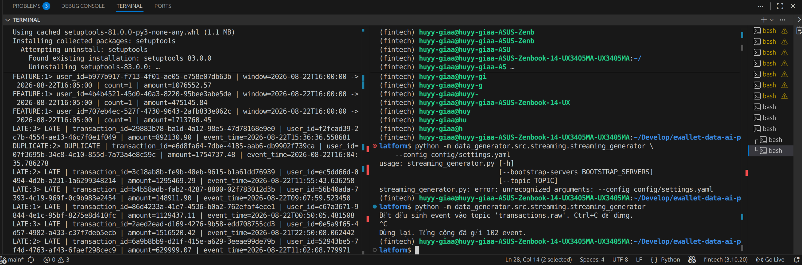
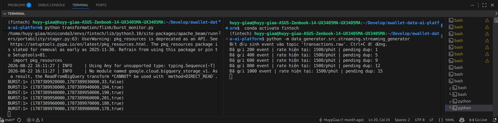

# Streaming Pipeline

## Goal

The streaming pipeline processes real-time E-wallet transactions from
Redpanda using PyFlink.

The pipeline demonstrates several common streaming data problems:

- Duplicate events
- Late-arriving events
- Out-of-order events
- Traffic bursts
- Event-Time window aggregation

The goal is to demonstrate how a streaming system can continuously
process transactions while handling events that may arrive repeatedly,
out of order or significantly later than their business timestamp.

## Architecture

```text
Transaction Generator
        ↓
Redpanda
topic: transactions.raw
        ↓
PyFlink
        ↓
JSON Parsing
        ↓
Deduplication
        ↓
Event Time + Watermark
        ↓
Late-event Handling
        ↓
5-minute User Window
        ↓
Incremental Aggregation
        ↓
FEATURE output
```

The streaming generator publishes transaction events to the
`transactions.raw` topic.

PyFlink consumes these events and applies the streaming transformations.

## Transaction Deduplication

The generator intentionally creates duplicate transaction events.

Transactions are keyed by:

`transaction_id`

A keyed `ValueState` records whether a transaction ID has already been
observed.

Conceptually:

```text
First occurrence
        ↓
state = empty
        ↓
accept transaction
        ↓
state = seen


Duplicate occurrence
        ↓
state = seen
        ↓
DUPLICATE output
```

The state uses a **30-minute TTL**.

The TTL prevents deduplication state from growing indefinitely while
still allowing duplicates arriving within the configured period to be
detected.

## Event Time and Watermarks

The main transaction pipeline uses **Event Time**.

The Event Time of each transaction is taken from its business
`timestamp` rather than the time at which Flink processes the event.

This is important because transaction events may arrive out of order.

The pipeline uses a bounded out-of-orderness watermark of:

```text
10 seconds
```

Conceptually:

```text
maximum observed Event Time
              ↓
        minus 10 seconds
              ↓
          watermark
```

The watermark represents Flink's progress through Event Time.

It does not mean that Flink waits or sleeps for 10 seconds before
processing each event.

The pipeline also uses **30 seconds of idleness detection** so that an
idle Kafka partition does not indefinitely prevent watermark progress.

## Late-arriving Events

The streaming generator intentionally creates late-arriving
transactions.

The pipeline uses:

| Setting | Value |
|---|---:|
| Watermark delay | 10 seconds |
| Allowed lateness | 60 seconds |

An event whose Event Time is behind the current watermark is considered
late.

However, a late event may still be accepted while its original window
remains within the allowed-lateness period.

Conceptually:

```text
window_end
    +
60 seconds allowed lateness
    ↓
final acceptance boundary
```

Events arriving after:

```text
window_end + allowed_lateness
```

are classified as too late and sent to the `LATE` output.

## Window Aggregation

Transactions are grouped by `user_id`.

The pipeline uses a **5-minute tumbling Event-Time window**.

For example:

```text
16:00 ───────────── 16:05
16:05 ───────────── 16:10
16:10 ───────────── 16:15
```

Tumbling windows do not overlap.

For each user and window, an incremental accumulator maintains:

```text
(
    transaction_count,
    total_amount
)
```

The final feature output contains:

```text
(
    user_id,
    window_start,
    window_end,
    transaction_count,
    total_amount
)
```

Incremental aggregation avoids storing every transaction inside the
window and instead updates the accumulator as events arrive.

## Streaming Pipeline Result

The final streaming pipeline successfully produced all three expected
output types:

- `FEATURE`
- `DUPLICATE`
- `LATE`

The reproduced run confirms that:

- Normal transactions contribute to user-window features.
- Repeated `transaction_id` values are detected as duplicates.
- Transactions arriving beyond the accepted Event-Time boundary are
  classified as late.



## Burst Detection

Traffic burst detection is implemented as a separate operational
monitoring job.

This job answers a different question from the Event-Time transaction
pipeline:

> How many events are reaching the system during the current period?

Because this is an operational arrival-rate metric, the burst monitor
uses **Processing Time** rather than Event Time.

The monitor uses a global:

```text
10-second tumbling Processing-Time window
```

Each incoming event increments an integer accumulator.

A window is classified as a burst when:

```text
event_count > 100
```

## Burst Experiment

For the burst experiment, the transaction generator was temporarily
configured with a **30x burst multiplier**.

The generator produced approximately:

```text
1500 events/minute
```

During the experiment, the burst monitor observed several consecutive
10-second windows:

| Event count | Burst detected |
|---:|:---:|
| 194 | true |
| 190 | true |
| 201 | true |
| 180 | true |
| 178 | true |

These windows exceeded the configured threshold of 100 events.

The experiment confirms that the Processing-Time monitor successfully
detects a sudden increase in the rate at which events reach the system.



After the experiment, the temporary burst test configuration was
reverted to the normal project configuration.

## Event Time vs Processing Time

The project intentionally uses different time semantics for different
streaming problems.

| Pipeline | Time semantics | Reason |
|---|---|---|
| Transaction feature pipeline | Event Time | Transactions should be grouped according to when the business event actually occurred |
| Burst monitor | Processing Time | The monitor measures how quickly events are currently reaching the system |

Using Processing Time for transaction behavior could produce incorrect
business windows when events arrive late.

Using Event Time for the operational burst monitor would measure event
timestamps rather than the current ingestion rate.

## Design Decisions

### Keyed State for Deduplication

Deduplication is keyed by `transaction_id` because the duplicate
decision belongs to each individual transaction.

The corresponding `ValueState` therefore exists logically per
transaction key.

### State TTL

The deduplication state uses a 30-minute TTL.

Without TTL, previously observed transaction IDs could remain in state
indefinitely and cause unbounded state growth.

### Watermark

A 10-second watermark delay provides limited tolerance for out-of-order
events while still allowing Event-Time windows to progress.

### Allowed Lateness

Allowed lateness is set to 60 seconds.

This allows moderately late events to still participate in their
original Event-Time window.

Events later than this boundary are classified separately.

### Incremental Aggregation

The user-window feature uses an incremental accumulator instead of
collecting every event in memory.

Only:

```text
count
total_amount
```

need to be updated for each new transaction.

### Separate Burst Monitor

Burst detection is separated from the business feature pipeline because
the two jobs answer different questions and use different time
semantics.

The feature pipeline focuses on transaction behavior.

The burst monitor focuses on operational event arrival rate.

## Trade-offs

A larger watermark delay would tolerate more out-of-order events but
would also delay Event-Time progress and window completion.

A larger allowed-lateness period would accept more delayed events but
would require Flink to retain window state for longer.

A longer deduplication TTL would detect duplicates over a wider time
range but would increase state usage.

A lower burst threshold would detect smaller traffic spikes but could
increase false positives.

A higher burst threshold would reduce false positives but could miss
smaller bursts.

The values used in this project are selected to demonstrate streaming
behavior clearly in the coursework environment rather than represent
production SLA tuning.

## Result

The PyFlink streaming implementation demonstrates:

```text
Redpanda ingestion
        ↓
Duplicate handling
        ↓
Event-Time processing
        ↓
Watermarks
        ↓
Allowed lateness
        ↓
5-minute tumbling windows
        ↓
Incremental user features

and separately:

Processing-Time windows
        ↓
Traffic rate monitoring
        ↓
Burst detection
```

The experiments successfully reproduced:

- Duplicate transaction handling
- Late-arriving event handling
- Event-Time user feature aggregation
- High-rate traffic burst detection