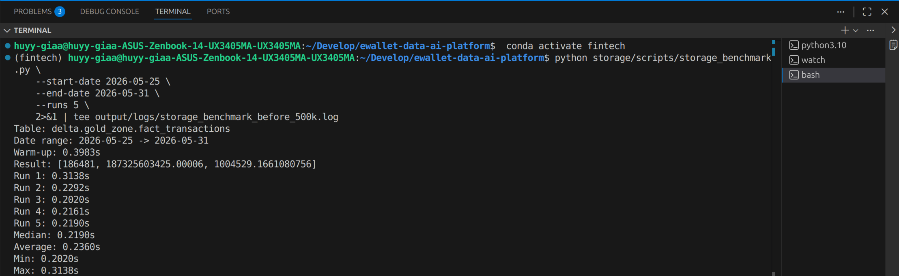
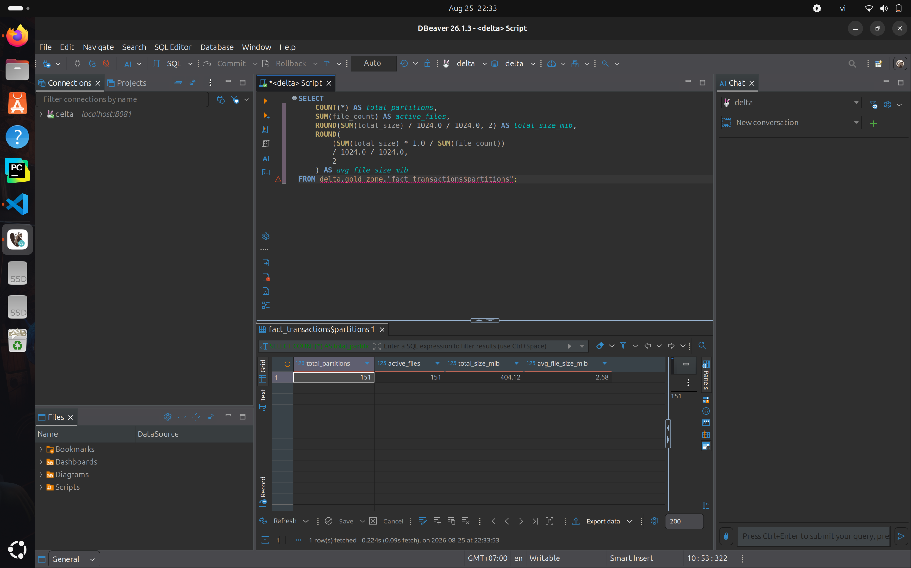
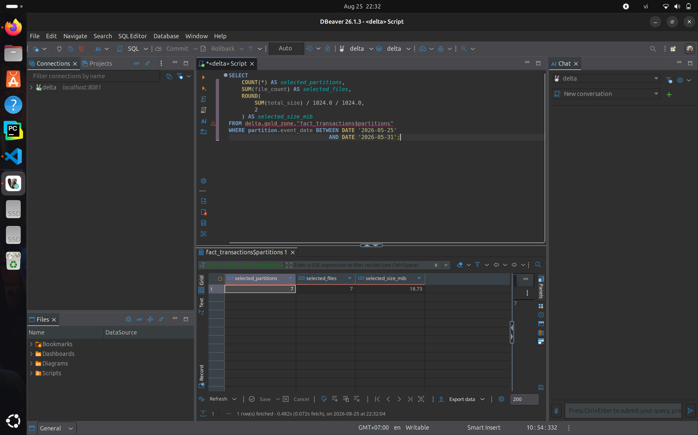
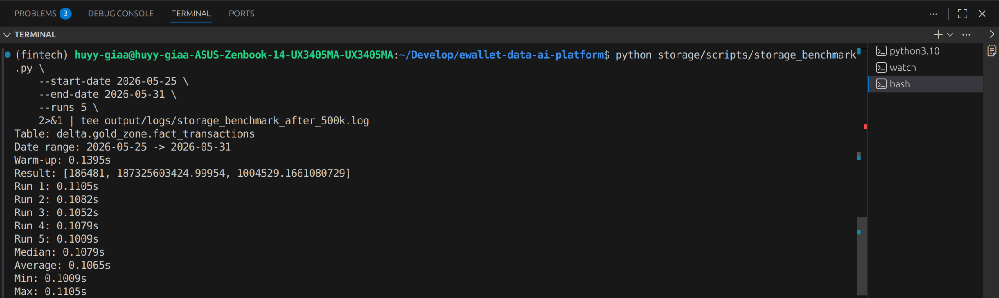

## Before Optimization

### Physical Layout

The Gold `fact_transactions` table contains **4,000,000 rows** covering

**151 daily partitions**.

Before compaction:

| Metric | Value |
|---|---:|
| Partitions | 151 |
| Active files | 2,188 |
| Active data size | 760.76 MiB |
| Average file size | 0.35 MiB |

Although the table is partitioned by `event_date`, each daily partition

contains many small Parquet files. The table therefore exhibits a

**small-file problem**.

On average, each partition contains approximately **14 active files**.


### Partition Pruning

The benchmark query filters the following seven-day range:

`2026-05-25` to `2026-05-31`

Before compaction, this selects:

- 7 of 151 partitions
- 102 active files
- 35.46 MiB of active data

Partitioning by `event_date` therefore allows Trino to prune unrelated

date partitions. However, the selected partitions still contain many

small files.


### Query Benchmark Before Compaction

The benchmark performs an analytical aggregation over the seven-day

date range.

Business result:

- Transaction count: 186,481
- Total amount: 187,325,603,425.00006
- Average amount: 1,004,529.1661080756

Performance over five measured runs:

| Metric | Runtime |
|---|---:|
| Median | 0.2190 s |
| Average | 0.2360 s |
| Minimum | 0.2020 s |
| Maximum | 0.3138 s |



## Compaction

The table was compacted using Trino:

```sql
ALTER TABLE delta.gold_zone.fact_transactions
EXECUTE optimize(file_size_threshold => '16MB');
```

The goal of this operation is to rewrite many small Parquet files into

fewer larger files without changing the logical transaction data.

No `VACUUM` operation was performed because the experiment keeps Delta

history available for debugging and evidence.

## After Optimization

### Physical Layout

After compaction:

| Metric | Value |
|---|---:|
| Partitions | 151 |
| Active files | 151 |
| Active data size | 404.12 MiB |
| Average file size | 2.68 MiB |

The table still contains **151 daily partitions**, but now contains only

**151 active files**.

This means the compacted layout contains approximately **one active

Parquet file per daily partition**.



### Partition Pruning After Compaction

For the same seven-day query range:

`2026-05-25` to `2026-05-31`

Trino selects:

- 7 of 151 partitions
- 7 active files
- 18.73 MiB of active data

The partition pruning behavior remains unchanged, but compaction reduces

the number of files inside the selected partitions from **102 to 7**.



### Query Benchmark After Compaction

The same analytical workload was executed again after compaction.

Performance over five measured runs:

| Metric | Runtime |
|---|---:|
| Median | 0.1079 s |
| Average | 0.1065 s |
| Minimum | 0.1009 s |
| Maximum | 0.1105 s |

The transaction count remained **186,481**, confirming that the benchmark

continued to process the same logical data.

A very small difference in the aggregated floating-point amount was

observed after the physical rewrite. This is caused by aggregation order

when using floating-point `DOUBLE` values and does not indicate row loss.



## Final Comparison

| Metric | Before | After |
|---|---:|---:|
| Partitions | 151 | 151 |
| Active files | 2,188 | 151 |
| Active data size | 760.76 MiB | 404.12 MiB |
| Average file size | 0.35 MiB | 2.68 MiB |
| Files scanned for 7-day range | 102 | 7 |
| Data size for 7-day range | 35.46 MiB | 18.73 MiB |
| Median query runtime | 0.2190 s | 0.1079 s |
| Average query runtime | 0.2360 s | 0.1065 s |

Compaction reduced the number of active files from **2,188 to 151**,

corresponding to an approximately **93.10% reduction**.

For the seven-day benchmark range, the number of active files was reduced

from **102 to 7**, while partition pruning continued to select only the

seven relevant `event_date` partitions.

The median analytical query latency decreased from **0.2190 seconds**

to **0.1079 seconds**, corresponding to an approximately **50.73% runtime

reduction** and a **2.03x speedup**.

The average active file size increased from **0.35 MiB to 2.68 MiB**,

showing that the physical layout became substantially less fragmented.

The active Delta snapshot size decreased from **760.76 MiB to

404.12 MiB**. Old files may still physically remain in object storage

because Delta Lake preserves previous versions until a future `VACUUM`

operation removes files that are no longer required.

### Trade-off

Compaction requires an additional rewrite operation and therefore

consumes compute and I/O resources.

It should be executed when the performance benefit of reducing small

files outweighs the cost of rewriting data.

In this experiment, the rewrite cost was justified because the table

had a severe small-file problem and the analytical benchmark improved

from **0.2190 s to 0.1079 s median runtime**.

No `VACUUM` operation was performed in order to preserve Delta history

and debugging evidence.