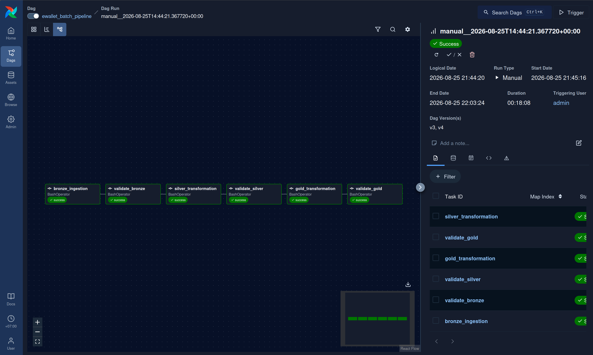

# Airflow Orchestration

## Goal

Orchestrate the offline E-wallet pipeline instead of manually executing
DP1, DP2, DP3 and validation scripts.

Airflow is responsible for task dependencies, retries, scheduling,
execution status and logs. The transformation logic remains inside
the existing Bronze, Silver and Gold pipeline scripts.

## Pipeline

```text
bronze_ingestion
        ↓
validate_bronze
        ↓
silver_transformation
        ↓
validate_silver
        ↓
gold_transformation
        ↓
validate_gold
```

Each downstream task runs only when the previous task succeeds.

## Configuration

- Airflow version: 3.3.1
- Executor: LocalExecutor
- Schedule: daily
- Catchup: disabled
- Retries: 2
- Retry delay: 2 minutes
- Airflow UI port: 8080
- `project_root` and `fintech_python` are stored as Airflow Variables

## Quality Gates

Validation tasks are placed between data layers.

For example:

```text
silver_transformation
        ↓
validate_silver
        ↓
gold_transformation
```

If `validate_silver` fails, `gold_transformation` is not executed.
This prevents invalid data from propagating to the next layer.

## Retry and Failure Handling

During integration testing, `bronze_ingestion` failed because the
offline source path was incorrect.

Airflow automatically retried the task according to the retry policy,
while downstream tasks remained blocked.

This verified that task dependency and retry handling worked correctly.

## Final Run

The final DAG was executed on the dataset generated from 500,000 users.

Dataset scale:

- Users: 500,000
- Accounts: 500,000
- Devices: 500,000
- Bronze transactions: 4,080,000
- Balance snapshots: 3,895,224
- Login events: 3,997,362

All six tasks completed successfully.

Total DAG runtime was approximately **18 minutes 08 seconds**.

## Evidence

