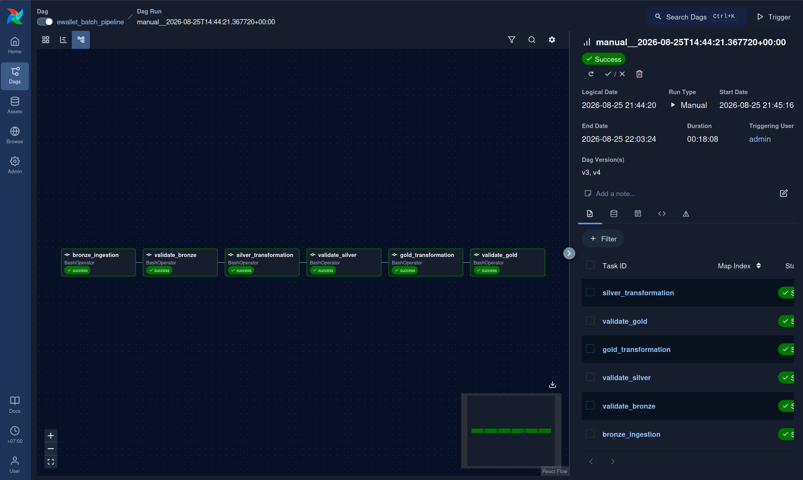

# Airflow Orchestration

## Goal

Orchestrate the offline E-wallet pipeline instead of manually executing
DP1, DP2, DP3 and validation scripts.

Airflow is responsible for task dependencies, retries, scheduling,
execution status and logs. The transformation logic remains inside
the existing Bronze, Silver and Gold pipeline scripts.

## Pipeline

```text
bronze_ingestion
        ↓
validate_bronze
        ↓
silver_transformation
        ↓
validate_silver
        ↓
gold_transformation
        ↓
validate_gold
```

Each downstream task runs only when the previous task succeeds.

The DAG ends at Gold validation. Trino registration and DataHub metadata,
lineage, and assertion publication remain explicit post-pipeline operations.

The four Bronze/Silver task commands use `--include-fraud-labels`, so the
canonical six-stage run keeps the label table synchronized with transactions.

## Configuration

- Airflow version: 3.3.1
- Executor: LocalExecutor
- Schedule: daily
- Catchup: disabled
- Retries: 2
- Retry delay: 2 minutes
- Airflow UI port: 8080

DataHub GMS owns host port `8080` in the combined local environment. Airflow
must be assigned a different host port before its UI can run alongside
DataHub. This document records the current Airflow default; the Airflow runtime
port change remains a separate follow-up.

- `project_root` and `fintech_python` are stored as Airflow Variables

## Quality Gates

Validation tasks are placed between data layers.

For example:

```text
silver_transformation
        ↓
validate_silver
        ↓
gold_transformation
```

If `validate_silver` fails, `gold_transformation` is not executed.
This prevents invalid data from propagating to the next layer.

## Retry and Failure Handling

During integration testing, `bronze_ingestion` failed because the
offline source path was incorrect.

Airflow automatically retried the task according to the retry policy,
while downstream tasks remained blocked.

This verified that task dependency and retry handling worked correctly.

## Canonical Phase 2 verification

The F3 rebuild used the six exact DAG task commands against the canonical
dataset generated from 500,000 users. The local Airflow 3.3.1 metadata database
requires a separate migration before a DagRun can be recorded, so F3 did not
mutate that database solely for orchestration evidence. A read-only `DagBag`
parse confirmed the DAG ID, six-task graph, `max_active_runs=1`, zero import
errors, and all four required fraud flags.

Dataset scale:

- Users: 500,000
- Accounts: 500,000
- Devices: 519,590
- Bronze transactions: 4,080,000
- Balance snapshots: 3,881,538
- Login events: 3,999,581
- Fraud labels: 4,000,000

All six commands completed successfully in **15 minutes 54 seconds**. This is
manual execution of the rendered task commands, not a recorded Airflow DagRun.

## Evidence



The screenshot is retained as earlier orchestration evidence; the F3 command
and runtime evidence is recorded in
[`evidence/f3_canonical_fraud_migration.json`](evidence/f3_canonical_fraud_migration.json).
These measurements are baseline runtime evidence for later comparison, not
optimized results.
