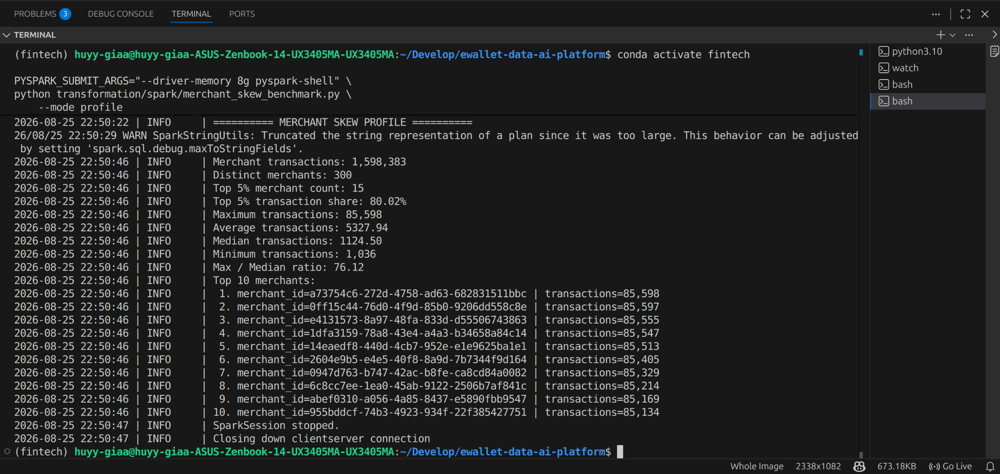
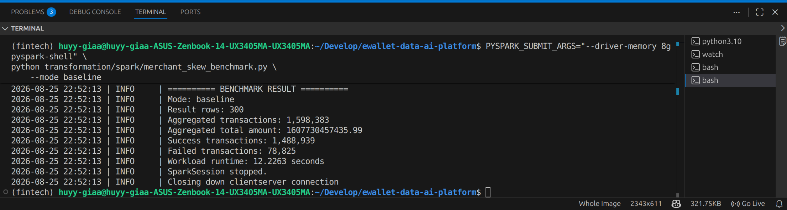
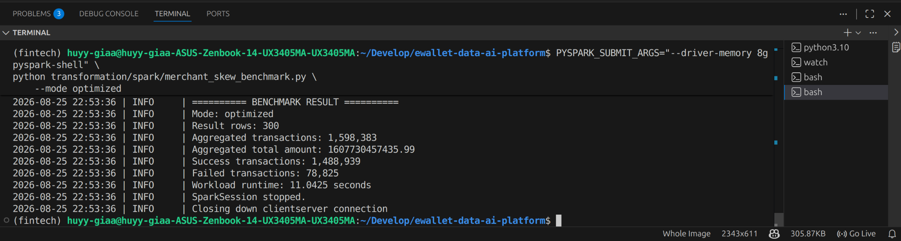
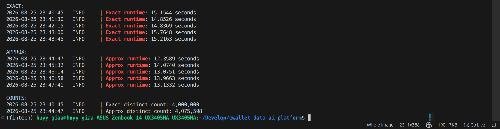

# Spark Performance Benchmarks

## Merchant Skew

### Problem

The transaction generator intentionally creates merchant-key skew.
The top 5% of merchants are configured to receive approximately 80%
of merchant transaction traffic.

### Dataset

Final offline dataset:

- Users: 500,000
- Bronze transactions: 4,080,000
- Silver transactions after deduplication: 4,000,000

### Skew Profile

The final Silver dataset produced:

- Merchant transactions: 1,598,383
- Distinct merchants: 300
- Top 5% merchant count: 15
- Top 5% transaction share: 80.02%
- Maximum transactions per merchant: 85,598
- Average transactions per merchant: 5,327.94
- Median transactions per merchant: 1,124.50
- Minimum transactions per merchant: 1,036
- Max / median ratio: 76.12

The result confirms a strong merchant-key skew: only 15 merchants
receive approximately 80% of merchant traffic, while the busiest
merchant has about 76 times the transaction count of the median merchant.

### Evidence

### Baseline

The baseline workload was executed with Adaptive Query Execution
and skew join optimization disabled.

Results:

- Result rows: 300
- Aggregated merchant transactions: 1,598,383
- Aggregated total amount: 1,607,730,457,435.99
- Successful transactions: 1,488,939
- Failed transactions: 78,825
- Workload runtime: **12.2263 seconds**

The aggregated transaction count matches the merchant skew profile,
confirming that the baseline workload processed the expected data.

### AQE Optimized Run

The optimized workload was executed with Adaptive Query Execution
and skew join optimization enabled.

Results:

- Result rows: 300
- Aggregated merchant transactions: 1,598,383
- Aggregated total amount: 1,607,730,457,435.99
- Successful transactions: 1,488,939
- Failed transactions: 78,825
- Workload runtime: **11.0425 seconds**

The output matches the baseline result, confirming workload correctness.

### Baseline vs AQE Comparison

Five independent runs were executed for each configuration.

| Metric | Baseline | AQE Optimized |
|---|---:|---:|
| Median runtime | 13.3611 s | 13.6310 s |
| Average runtime | 13.5166 s | 13.2560 s |
| Minimum runtime | 12.9129 s | 12.3631 s |
| Maximum runtime | 14.2393 s | 13.8842 s |

The median runtime changed from 13.3611 s to 13.6310 s, while the
average runtime improved by approximately 1.93%.

The difference is small and inconsistent across runs, therefore no
significant performance improvement was observed from enabling AQE
and skew join optimization for this workload.

Although the source transaction data is strongly skewed, the workload
aggregates transactions by `merchant_id` before joining with the
merchant dimension. Partial aggregation substantially reduces the
amount of data reaching the join stage.

As a result, the shuffled join is no longer dominated by the original
merchant-key skew, leaving little opportunity for AQE skew join
optimization to improve execution time.

### Physical Plan Observation

The optimized execution produced an `AdaptiveSparkPlan` with
`isFinalPlan=true`, confirming that AQE was active.

The final workload still used a `SortMergeJoin`. This supports the
observation that AQE did not need to substantially restructure the
join for this workload.

## High Cardinality

### Problem

`transaction_id` is a high-cardinality column because each transaction
has a unique identifier.

The final Silver transaction table contains 4,000,000 deduplicated
transactions.

The benchmark compares:

- `count_distinct(transaction_id)` for exact cardinality
- `approx_count_distinct(transaction_id, 0.05)` for approximate cardinality

Each mode was executed five times in separate Spark processes.

### Results

| Metric | Exact | Approximate |
|---|---:|---:|
| Distinct count | 4,000,000 | 4,075,598 |
| Median runtime | 15.1544 s | 13.1332 s |
| Average runtime | 15.1650 s | 13.3215 s |
| Minimum runtime | 14.8369 s | 12.3589 s |
| Maximum runtime | 15.7648 s | 14.0740 s |

The approximate method reduced median runtime by approximately **13.34%**,
corresponding to about **1.15x speedup**.

The estimated cardinality was 4,075,598 compared with the exact value
of 4,000,000, producing a relative error of approximately **1.89%**.

This demonstrates the trade-off of approximate aggregation for
high-cardinality workloads: lower execution cost in exchange for a
small estimation error.

`RSD = 0.05` represents the target relative standard deviation of the
approximation algorithm and should not be interpreted as a guaranteed
maximum error of 5%.

### Evidence

