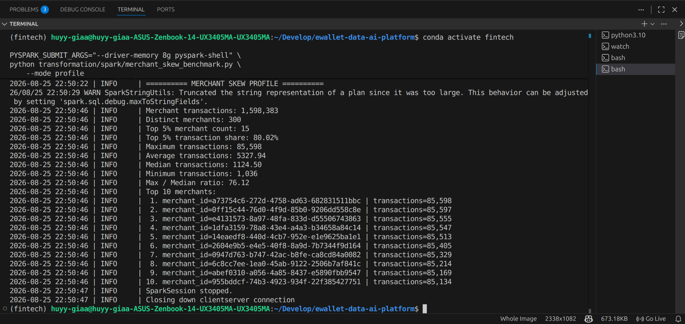
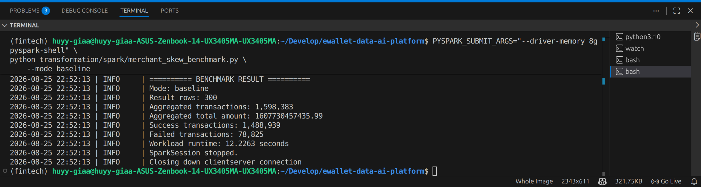
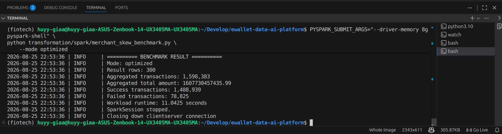
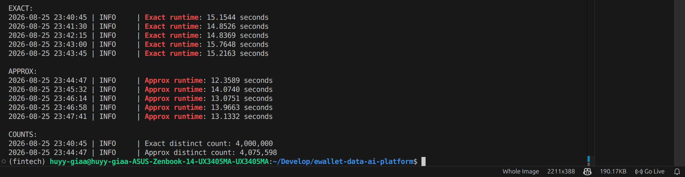

# Performance Benchmarks

## F6 Feast offline historical retrieval baseline — not optimized

F6 measured deterministic bounded retrieval against the canonical Gold-derived
Parquet adapter. It did not run a four-million-row retrieval, collect a Gold
table to the driver, tune Dask, or claim a speedup. Both measurements used the
same 100 entity rows on the local development machine with Feast 0.66.0.

| Retrieval | Entity rows | Feature columns | Output rows | Runtime | Rows/s |
|---|---:|---:|---:|---:|---:|
| Single `user_behavior` FeatureView | 100 | 9 | 100 | 3.6229 s | 27.60 |
| Combined user/account/device/merchant | 100 | 31 | 100 | 14.5663 s | 6.87 |

The combined wrapper queries each real entity grain and keeps non-payment rows
whose merchant is null. This baseline includes local FileSource scans and Dask
point-in-time joins. No peak-memory measurement was captured. The raw source
decision, precision audit, correctness gates, and measurements are stored in
[`evidence/f6_feast_offline_baseline.json`](evidence/f6_feast_offline_baseline.json).

**FEAST OPTIMIZATION: NOT PERFORMED.**

## F5 historical feature computation baseline — not optimized

F5 ran the existing optimized-mode Spark configuration for operational
consistency, but did not tune or compare plans. These measurements are a
feature-computation baseline, not an optimization claim. The canonical source
generator was not rerun.

| Feature job | Input rows | Output rows | Persisted partitions | Runtime |
|---|---:|---:|---:|---:|
| `feat_user_behavior` | 4,000,000 | 3,999,910 | 5 | 14.48 s |
| `feat_account_behavior` | 4,000,000 | 3,999,910 | 5 | 13.45 s |
| `feat_device_behavior` | 4,000,000 | 3,999,910 | 4 | 11.37 s |
| `feat_merchant_behavior` | 1,600,148 raw eligible payments | 1,600,084 | 5 | 26.63 s |

Spark 4.1.1 ran with `local[4]`, 8 GB driver memory, AQE and skew-join
handling enabled, 32 shuffle partitions, and 81 Silver transaction scan
partitions. Feature builders use microsecond range windows with the exclusive
upper bound `T-1µs`, then collapse same-entity/same-timestamp peers into one
snapshot. Outputs are not directory-partitioned.

The merchant input contains 1,600,148 payment transactions with a non-null
`merchant_id`. Those transactions contain 1,600,084 distinct
`merchant_id + event_timestamp` keys, so the shared-snapshot output has
1,600,084 rows. The smaller output is a consequence of the contracted grain;
it is not the raw eligible-payment count.

The merchant job was the slowest feature write. F5 records that bottleneck and
does not optimize it. The final Gold pipeline rerun completed in 242.24 seconds
(251.37 seconds wall time); independent Gold validation produced 99 PASS / 0
FAIL in 220.61 seconds wall time. Raw evidence is stored in
[`evidence/f5_historical_feature_baseline.json`](evidence/f5_historical_feature_baseline.json).

## F4C Spark batch baseline

This is the measured **F4C BASELINE — NOT OPTIMIZED** for the canonical dataset
regenerated after the fraud generator realism redesign. It establishes the
reference for a later optimization task; F4C did not tune Spark or change
transformation logic.

Dataset scale:

- 500,000 users, 674,383 accounts, and 572,632 devices
- 4,080,000 physical Bronze transaction rows and 4,000,000 logical rows
- 4,000,000 fraud labels
- 3,893,408 balance snapshots and 3,999,990 login events

| Stage | Input / output | Runtime |
|---|---|---:|
| Bronze ingestion | 9 source files -> 8 Delta tables | 67.85 s |
| Bronze validation | 8 tables; 49 PASS / 0 FAIL | 59.19 s |
| Silver transformation | 8 Bronze -> 8 Silver; 4.08M -> 4.00M transactions | 141.55 s |
| Silver validation | 8 tables; 53 PASS / 0 FAIL | 187.08 s |
| Gold transformation | 7 Silver business tables -> 11 Gold tables | 193.15 s |
| Gold validation | 67 PASS / 0 FAIL | 186.44 s |

The transformations used Spark 4.1.1 with `local[4]`, 32 shuffle partitions,
AQE and skew-join handling enabled, and the existing DAG runtime prerequisite
`PYSPARK_SUBMIT_ARGS="--driver-memory 8g pyspark-shell"`. An initial Silver
invocation that omitted that setting ran out of Java heap; rerunning the exact
DAG command completed successfully. The failed 80.49-second attempt is not
included in the successful baseline above. This prerequisite is not an
optimization result. The Gold OBT was the longest individually logged Gold
build at 60.71 seconds.

The machine-readable counts, manifests, runtimes, configuration, warnings, and
cross-layer checks are in
[`evidence/f4c_canonical_regeneration.json`](evidence/f4c_canonical_regeneration.json).
No Spark UI screenshot or derived chart was retained because the raw measured
evidence and tables were sufficient.

## Merchant Skew

### Problem

The transaction generator intentionally creates merchant-key skew.
The top 5% of merchants are configured to receive approximately 80%
of merchant transaction traffic.

### Dataset

Historical Phase 1 benchmark dataset:

- Users: 500,000
- Bronze transactions: 4,080,000
- Silver transactions after deduplication: 4,000,000

### Skew Profile

The final Silver dataset produced:

- Merchant transactions: 1,598,383
- Distinct merchants: 300
- Top 5% merchant count: 15
- Top 5% transaction share: 80.02%
- Maximum transactions per merchant: 85,598
- Average transactions per merchant: 5,327.94
- Median transactions per merchant: 1,124.50
- Minimum transactions per merchant: 1,036
- Max / median ratio: 76.12

The result confirms a strong merchant-key skew: only 15 merchants
receive approximately 80% of merchant traffic, while the busiest
merchant has about 76 times the transaction count of the median merchant.

### Evidence

### Baseline

The baseline workload was executed with Adaptive Query Execution
and skew join optimization disabled.

Results:

- Result rows: 300
- Aggregated merchant transactions: 1,598,383
- Aggregated total amount: 1,607,730,457,435.99
- Successful transactions: 1,488,939
- Failed transactions: 78,825
- Workload runtime: **12.2263 seconds**

The aggregated transaction count matches the merchant skew profile,
confirming that the baseline workload processed the expected data.

### AQE Optimized Run

The optimized workload was executed with Adaptive Query Execution
and skew join optimization enabled.

Results:

- Result rows: 300
- Aggregated merchant transactions: 1,598,383
- Aggregated total amount: 1,607,730,457,435.99
- Successful transactions: 1,488,939
- Failed transactions: 78,825
- Workload runtime: **11.0425 seconds**

The output matches the baseline result, confirming workload correctness.

### Baseline vs AQE Comparison

Five independent runs were executed for each configuration.

| Metric | Baseline | AQE Optimized |
|---|---:|---:|
| Median runtime | 13.3611 s | 13.6310 s |
| Average runtime | 13.5166 s | 13.2560 s |
| Minimum runtime | 12.9129 s | 12.3631 s |
| Maximum runtime | 14.2393 s | 13.8842 s |

The median runtime changed from 13.3611 s to 13.6310 s, while the
average runtime improved by approximately 1.93%.

The difference is small and inconsistent across runs, therefore no
significant performance improvement was observed from enabling AQE
and skew join optimization for this workload.

Although the source transaction data is strongly skewed, the workload
aggregates transactions by `merchant_id` before joining with the
merchant dimension. Partial aggregation substantially reduces the
amount of data reaching the join stage.

As a result, the shuffled join is no longer dominated by the original
merchant-key skew, leaving little opportunity for AQE skew join
optimization to improve execution time.

### Physical Plan Observation

The optimized execution produced an `AdaptiveSparkPlan` with
`isFinalPlan=true`, confirming that AQE was active.

The final workload still used a `SortMergeJoin`. This supports the
observation that AQE did not need to substantially restructure the
join for this workload.

## High Cardinality

### Problem

`transaction_id` is a high-cardinality column because each transaction
has a unique identifier.

The final Silver transaction table contains 4,000,000 deduplicated
transactions.

The benchmark compares:

- `count_distinct(transaction_id)` for exact cardinality
- `approx_count_distinct(transaction_id, 0.05)` for approximate cardinality

Each mode was executed five times in separate Spark processes.

### Results

| Metric | Exact | Approximate |
|---|---:|---:|
| Distinct count | 4,000,000 | 4,075,598 |
| Median runtime | 15.1544 s | 13.1332 s |
| Average runtime | 15.1650 s | 13.3215 s |
| Minimum runtime | 14.8369 s | 12.3589 s |
| Maximum runtime | 15.7648 s | 14.0740 s |

The approximate method reduced median runtime by approximately **13.34%**,
corresponding to about **1.15x speedup**.

The estimated cardinality was 4,075,598 compared with the exact value
of 4,000,000, producing a relative error of approximately **1.89%**.

This demonstrates the trade-off of approximate aggregation for
high-cardinality workloads: lower execution cost in exchange for a
small estimation error.

`RSD = 0.05` represents the target relative standard deviation of the
approximation algorithm and should not be interpreted as a guaranteed
maximum error of 5%.

### Evidence

