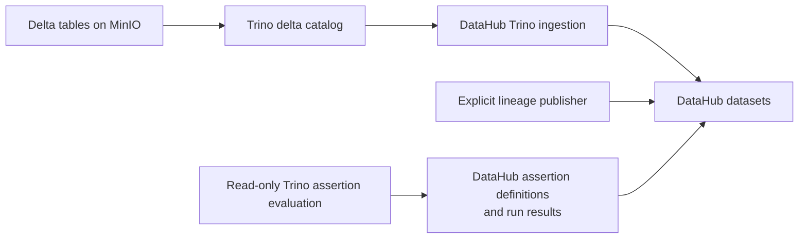
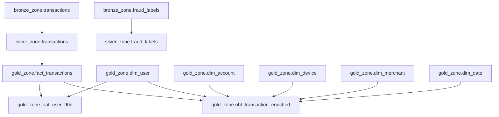

# DataHub metadata, lineage, and assertions

## Scope

DataHub is the metadata catalog for the E-Wallet lakehouse. It discovers the
registered Delta tables through Trino, stores selected direct dataset lineage,
and displays representative data-quality assertions. The transaction data
remains in Delta Lake on MinIO.

The current canonical runtime has 8 Bronze, 8 Silver, and 11 Gold tables
(27 total). The historical Phase 1 runtime had 7 Bronze, 7 Silver, and 11 Gold
tables (25 total).

DataHub is a separate local Quickstart runtime. It is not a service in the
platform's split Compose project.

## Tested local runtime

| Component | Tested version or endpoint |
|---|---|
| Requested Quickstart series | `v1.7.0` |
| Pinned Quickstart Compose Git ref | `v1.7.0.1` |
| DataHub server | `v1.7.0.1` |
| `acryl-datahub` CLI/SDK | `1.7.0.5` |
| GMS | `http://localhost:8080` |
| UI | `http://localhost:9002` |
| Quickstart Kafka host listener | `localhost:9093` |
| Quickstart Kafka internal listener | `broker:29092` |
| Trino metadata source | `localhost:8081` |

Redpanda retains host Kafka port `9092`. The pinned upstream Quickstart compose
at Git ref `v1.7.0.1` publishes Kafka on the same port and hard-codes the
advertised listener. The repository helper downloads that exact upstream file,
verifies its SHA-256,
and changes only the published and advertised host Kafka port to `9093`.
Generated files stay in an ignored runtime cache; no `/tmp` edit is required.

Select the Python interpreter containing `acryl-datahub==1.7.0.5`:

```bash
export DATAHUB_PYTHON=/path/to/datahub-environment/bin/python
```

Start and verify the runtime:

```bash
./data_platform/metadata/datahub/runtime/start_datahub.sh start
./data_platform/metadata/datahub/runtime/start_datahub.sh check
curl --fail http://localhost:8080/config
```

Stop containers without deleting the named Quickstart volumes:

```bash
./data_platform/metadata/datahub/runtime/start_datahub.sh stop
```

The helper never invokes `datahub docker nuke`. More details are in
[`data_platform/metadata/datahub/runtime/README.md`](../data_platform/metadata/datahub/runtime/README.md).

DataHub GMS owns host port `8080`; Redpanda Console uses `8082`. Airflow also
defaults to `8080`, so Airflow needs a supported alternate host port when both
runtimes are active.

## Metadata flow



### Register Delta tables in Trino

A Delta path can exist in MinIO without being visible in Trino. After Spark
produces Silver and Gold, run the metadata-only registration tool:

```bash
python3 -m data_platform.storage.scripts.register_trino_tables \
  --layer all \
  --include-fraud-labels
```

Without the flag, the legacy 25-table Phase 1 inventory remains available as
compatibility behavior. The canonical command uses the flag, and a missing
Bronze or Silver `fraud_labels` fails preflight.

It verifies every expected `_delta_log`, creates missing schemas, registers
missing tables, checks existing locations, and executes lightweight readability
queries. Re-running is safe. A location mismatch fails instead of dropping or
re-pointing a table.

### Ingest Trino metadata

The recipe at `data_platform/metadata/datahub/lineage/trino_recipe.yml` includes only
`bronze_zone`, `silver_zone`, and `gold_zone`; profiling is disabled to avoid a
full analytical scan.

```bash
DATAHUB_TELEMETRY_ENABLED=false \
  "$DATAHUB_PYTHON" -m datahub ingest \
  -c data_platform/metadata/datahub/lineage/trino_recipe.yml
```

This requires Trino on `localhost:8081` and DataHub GMS on `localhost:8080`.

## Selected direct lineage

The publisher at `data_platform/metadata/datahub/lineage/create_lineage.py`
publishes the ten retained Phase 1 relationships plus the canonical fraud-label
relationship shown below:



The feature builder reads `fact_transactions` and `dim_user` directly. The OBT
and feature table are sibling downstream datasets; there is no OBT-to-feature
edge.

The canonical graph has one additional fraud-label relationship, for eleven
direct edges in total. Publish it after metadata ingestion creates the dataset
entities:

```bash
DATAHUB_TELEMETRY_ENABLED=false \
  "$DATAHUB_PYTHON" data_platform/metadata/datahub/lineage/create_lineage.py \
  --include-fraud-labels
```

This script intentionally covers the main transaction path rather than every
Gold dependency.

## Selected data-quality assertions

The contracts describe expectations and the Silver/Gold validators enforce the
complete executable rule set. Eight checks are retained from Phase 1:

| Assertion | Target dataset |
|---|---|
| Required transaction fields contain no nulls | `silver.transactions` |
| Transaction ID is unique | `silver.transactions` |
| Account foreign key has no orphans | `silver.transactions` |
| Fact population equals Silver transactions | `gold.fact_transactions` |
| OBT population equals transaction fact | `gold.obt_transaction_enriched` |
| OBT transaction ID is unique | `gold.obt_transaction_enriched` |
| Feature population equals user dimension | `gold.feat_user_90d` |
| Failed transaction rate is within `[0, 1]` | `gold.feat_user_90d` |

The publisher evaluates current data with read-only Trino SQL. It does not
change Delta tables. Each definition has a deterministic assertion URN, so a
repeat publication updates the same logical definitions and records new
timestamped run results.

Fraud-enabled mode adds three deterministic checks for
`silver_zone.fraud_labels`: unique `transaction_id`, required/domain/
conditional semantics, and exact transaction coverage. Self-test can validate
all eleven definitions without accessing Trino or DataHub:

```bash
DATAHUB_TELEMETRY_ENABLED=false \
  "$DATAHUB_PYTHON" data_platform/metadata/datahub/assertions/publish_assertions.py \
  --self-test \
  --include-fraud-labels
```

Both fraud tables must exist in canonical Trino before fraud-enabled dry-run or
publication. There is no Gold fraud copy, training dataset, Feast feature, or
model artifact in F3.

Run the canonical local self-test and no-write evaluation:

```bash
DATAHUB_TELEMETRY_ENABLED=false \
  "$DATAHUB_PYTHON" data_platform/metadata/datahub/assertions/publish_assertions.py \
  --self-test --include-fraud-labels

DATAHUB_TELEMETRY_ENABLED=false \
  "$DATAHUB_PYTHON" data_platform/metadata/datahub/assertions/publish_assertions.py \
  --dry-run --include-fraud-labels
```

Publish after Trino, GMS, and the four target dataset entities are available:

```bash
DATAHUB_GMS_URL=http://localhost:8080 \
DATAHUB_TELEMETRY_ENABLED=false \
  "$DATAHUB_PYTHON" data_platform/metadata/datahub/assertions/publish_assertions.py \
  --publish --include-fraud-labels
```

Set `DATAHUB_GMS_TOKEN` only when the target GMS requires authentication. The
publisher validates the endpoint and all target entities before it sends any
definition.

F4C runtime verification against server `v1.7.0.1` scanned all 27 current
Trino datasets, read back all eleven expected direct lineage edges, and
published all eleven assertion definitions and successful run results. Server
read-back found eleven unique configured assertion URNs, correct dataset
associations, `SUCCESS` as every latest result, and zero logical duplicates.
The measured evidence is in
[`evidence/f4c_canonical_regeneration.json`](evidence/f4c_canonical_regeneration.json).

## Evidence and limits

The screenshot under `docs/evidence/datahub/01_transaction_lineage.png` proves
an earlier working DataHub integration. It predates the corrected direct
feature dependencies and is retained as historical evidence; the Python source
is canonical.

Current boundaries:

- DataHub metadata ingestion depends on Delta tables being registered in Trino.
- The explicit lineage script covers selected transaction datasets, not the
  complete Gold graph.
- The eleven assertions are a selected visible subset of validator coverage.
- Airflow does not invoke registration, metadata ingestion, lineage, or
  assertion publication.
- DataHub Quickstart is suitable for local coursework, not a production
  deployment.
