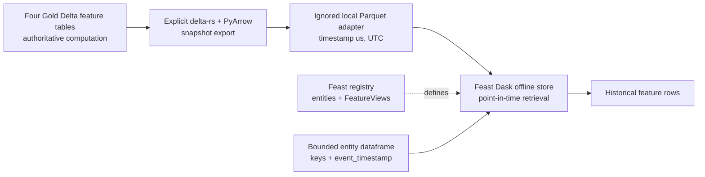

# Feast offline historical retrieval

## Role and scope

F6 adds Feast 0.66.0 as the offline retrieval layer for the four historical
fraud feature tables implemented in F5. Gold remains the authoritative feature
computation and persistence layer. Feast adds a versioned entity/FeatureView
contract and point-in-time retrieval API for building future training inputs.

The implemented objects are:

| Entity | Join key | FeatureView | Atomic features |
|---|---|---|---:|
| `user` | `user_id` | `user_behavior` | 9 |
| `account` | `account_id` | `account_behavior` | 10 |
| `device` | `device_id` | `device_behavior` | 5 |
| `merchant` | `merchant_id` | `merchant_behavior` | 7 |

The FeatureViews contain only the atomic historical features defined by the
[fraud feature contract](fraud_feature_design.md). They do not contain labels,
fraud type, current transaction status or balance, request fields, or derived
ratios and z-scores. There is no transaction entity because retrieval joins the
four actual feature grains to an entity dataframe at request event time.

F6 has no online store, Redis materialization, streaming feature computation,
training dataset, model, or serving path. `online_store: null` and
`online=False` make this boundary explicit.

## Implemented data flow



The project export command creates a local runtime copy under
`ai_platform/features/feast/feature_repo/data/offline/`. Feast does not create
that copy. Feast manages definitions and retrieves from the configured
FileSources. The directory is ignored by Git and must be refreshed after the
Gold snapshot changes. Do not run Feast retrieval against the previous snapshot
after a Gold change: rerun the exporter, then run the precision audit. Continue
only after the exporter's schema, row parity, and `timestamp[us, tz=UTC]` checks
and the audit's entity/timestamp key parity check pass. The generated Parquet
snapshot is runtime data, not canonical storage; Gold Delta remains the source
of truth.

This separation is needed because Feast 0.66.0 does not provide a native Delta
FileSource in this repository. It also makes the adapter deterministic and
reviewable without changing the four Gold tables.

## Offline source decision

The chosen source is the active Gold Delta snapshot exported to Parquet with
delta-rs and PyArrow, then read by Feast's Dask offline store and FileSource.

| Option | Result | Reason |
|---|---|---|
| Trino offline store | Rejected as canonical source | The project Trino surface exposes `timestamp(3)`. Millisecond projection collapses 11 distinct merchant snapshot keys, so it cannot preserve the validated Gold grain. Feast also documents Trino as a contributed implementation without full test coverage. |
| Native/direct Delta | Not available in the selected Feast setup | Feast 0.66.0 has no native Delta source configured here. Adding a new external integration would increase operational scope. |
| Parquet FileSource adapter | Selected | It preserves the active Delta snapshot's rows and `timestamp[us, tz=UTC]`, uses a Feast-supported local offline path, and keeps the conversion explicit. |

Gold is not replaced by Feast: Gold computes and persists the historical
snapshots; Feast resolves those snapshots point in time for requested entities.
The adapter is a full local snapshot today, not an incremental export, and is
therefore a reproducibility boundary and a current operational limitation.

## Timestamp precision gate

All four persisted Delta sources and exported Parquet datasets use
`timestamp[us, tz=UTC]`. Feast receives UTC-aware pandas timestamps. Pandas
uses a nanosecond-capable container, so the microseconds from the source are
retained without rounding.

| Table | Delta keys | Parquet keys | Keys after millisecond projection | Collapsed keys |
|---|---:|---:|---:|---:|
| `feat_user_behavior` | 3,999,910 | 3,999,910 | 3,999,910 | 0 |
| `feat_account_behavior` | 3,999,910 | 3,999,910 | 3,999,910 | 0 |
| `feat_device_behavior` | 3,999,910 | 3,999,910 | 3,999,910 | 0 |
| `feat_merchant_behavior` | 1,600,084 | 1,600,084 | 1,600,073 | 11 |

The Parquet adapter loses no entity/timestamp key. A focused fixture also
retrieves two snapshots 800 microseconds apart as distinct rows. Trino was not
started for F6 validation because the persisted precision audit already proves
that its millisecond representation is unsafe for the canonical merchant
grain.

```text
TIMESTAMP PRECISION: PASS
PRECISION LOSS: NO
PIT SAFETY IMPACT: the chosen source preserves the F5 snapshot grain;
                   Trino is rejected for canonical Feast retrieval.
```

## Point-in-time behavior

F5 precomputes every Gold snapshot with `[T-window, T)`: the current event,
future events, and same-timestamp peers are absent from the feature values.
Feast performs the as-of lookup at the entity dataframe's `event_timestamp`.
The F6 retrieval wrapper sends unique entity/timestamp snapshot keys to Feast
and left-joins the result back to a stable request row id. This is necessary
because the Dask path may coalesce duplicate request keys. Re-expansion keeps
all peer transactions and gives equal-timestamp peers the same snapshot.

Combined retrieval queries each FeatureView at its real entity grain. A null
`merchant_id` is excluded only from the merchant query and left-joined back as
null merchant features; the transaction and its user, account, and device
features remain present.

Cold-start values follow the Gold contract:

- historical counts and sums are `0`;
- averages, standard deviations, rates, and seconds-since values are null when
  their historical denominator or previous event does not exist;
- merchant features are null when a non-payment transaction has no merchant.

The deterministic fixture proves current/future exclusion, shared
same-timestamp snapshots, peer exclusion, cold start, nullable merchant
handling, direct source parity, and sub-millisecond retrieval. The canonical
validation uses ten bounded cases and compares all 31 feature columns with the
direct Gold snapshots: 310 comparable values and zero mismatches. Labels are
not passed to Feast.

## Commands from repository root

Create the isolated Feast environment and install the pinned dependency:

```bash
python -m venv ai_platform/features/feast/.venv
ai_platform/features/feast/.venv/bin/pip install \
  -r ai_platform/features/feast/requirements.txt
```

Export the current Gold snapshot using the existing platform environment, then
apply and inspect the Feast repository:

```bash
AWS_EC2_METADATA_DISABLED=true \
python -m ai_platform.features.feast.sources.export_gold_to_parquet

AWS_EC2_METADATA_DISABLED=true \
PYSPARK_SUBMIT_ARGS="--driver-memory 2g pyspark-shell" \
python -m ai_platform.features.feast.validation.precision_audit

PYTHONPATH=. ai_platform/features/feast/.venv/bin/feast \
  -c ai_platform/features/feast/feature_repo apply
PYTHONPATH=. ai_platform/features/feast/.venv/bin/feast \
  -c ai_platform/features/feast/feature_repo entities list
PYTHONPATH=. ai_platform/features/feast/.venv/bin/feast \
  -c ai_platform/features/feast/feature_repo feature-views list
```

Generate only the deterministic bounded validation inputs and run retrieval:

```bash
AWS_EC2_METADATA_DISABLED=true \
PYSPARK_SUBMIT_ARGS="--driver-memory 2g pyspark-shell" \
python -m ai_platform.features.feast.sources.export_validation_samples \
  --benchmark-rows 100

PYTHONPATH=. ai_platform/features/feast/.venv/bin/python \
  -m unittest tests.test_feast_offline -v

PYTHONPATH=. ai_platform/features/feast/.venv/bin/python \
  -m ai_platform.features.feast.validation.canonical_sample

PYTHONPATH=. ai_platform/features/feast/.venv/bin/python \
  -m ai_platform.features.feast.benchmark
```

The validation exporter collects only ten canonical rows and one hundred
benchmark entity rows. Its Gold lookups are restricted to exact selected
entity/timestamp keys. F6 does not run a four-million-row Feast retrieval or
collect a Gold table into pandas, Dask, or driver memory.

## Training-data boundary

F7 now combines request-time transaction fields, Feast historical features at
the request timestamp, `silver.fraud_labels`, and six shared derived
transformations. Its trainable materialization is deliberately bounded at
40,148 rows and retrieves at most 1,000 rows per Feast process. F6 still does
not perform a four-million-row retrieval or own the generated training
artifact. See the [fraud training dataset contract](fraud_training_dataset.md).

Labels enter only after historical retrieval. No label-to-FeatureView or model
lineage is published in DataHub. Existing F5 lineage remains unchanged.

## Baseline and limitations

The local, unoptimized 100-row measurements are recorded in
[`f6_feast_offline_baseline.json`](../evidence/f6_feast_offline_baseline.json)
and the [performance benchmark document](../07_performance_benchmarks.md).

Current limitations are:

- the Parquet snapshot is a local runtime copy and refresh is explicit;
- the Dask/FileSource baseline is suitable for bounded offline retrieval, not
  a claim of production-scale training throughput;
- no full-canonical Feast retrieval was attempted after local memory pressure;
- the wrapper is required to preserve duplicate request rows across the Dask
  retrieval path;
- no peak-memory measurement was captured;
- online serving, incremental materialization, and streaming parity remain
  outside F6.
