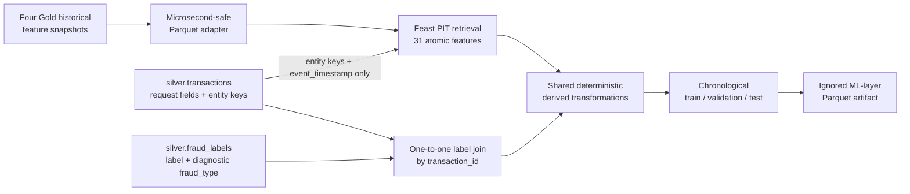

# Fraud training dataset contract and bounded build

## Role and current scope

F7 defines the supervised dataset consumed by a later fraud model. It combines
request-time transaction fields, point-in-time historical features retrieved
through Feast, the Silver fraud target, and deterministic derived features.
It does not train a model and does not turn the resulting artifact into a Gold
business table.

F7 keeps three scopes separate:

- the canonical population contains 4,000,000 logical transactions;
- the deterministic 302-row stratified sample verifies formulas and edge cases;
- the actual trainable materialization contains 40,148 rows selected by a
  label-independent `1/100` hash of UTC event timestamp.

Full canonical materialization is **not** supported on this local machine.
A 5,000-row Feast request triggered system memory protection, later 1,000-row
chunks reached 12.37 GiB peak RSS, swap reached 8 GiB, and the root filesystem
had only about 6 GiB free. F7 therefore uses 1,000-row checkpointed chunks and
restarts the Feast/Dask process between chunks. The generated Parquet data
under `ai_platform/ml/data/` is ignored runtime data.

## Grain, timestamp, and provenance

The grain is exactly one row per logical `transaction_id` from
`silver.transactions`. Each row represents a prediction immediately before
that transaction at its UTC `timestamp`, exposed as `event_timestamp`.
Transactions with the same entity and timestamp remain separate training rows;
they may share a historical snapshot, but neither transaction is history for
the other.



Labels never enter the Feast entity dataframe or any FeatureView. Gold remains
the authoritative historical computation layer. The Feast adapter must be
refreshed and validated after Gold changes, as described in the
[Feast offline guide](feast_offline.md).

## Column contract

The executable contract is
`ai_platform/ml/training/contract.py`. The output has 50 columns:

- 9 non-feature columns;
- 4 request-time model features;
- 31 historical Feast features;
- 6 derived model features.

### Identifiers and evaluation metadata

These columns identify and evaluate a row and are excluded from
`MODEL_FEATURE_COLUMNS`:

| Column | Purpose |
|---|---|
| `transaction_id` | Logical training-row key |
| `event_timestamp` | UTC prediction timestamp and split key |
| `user_id` | Feast user entity key |
| `account_id` | Feast account entity key |
| `device_id` | Feast device entity key |
| `merchant_id` | Nullable Feast merchant key and routing context |
| `label` | Binary target, `0` or `1` |
| `fraud_type` | Diagnostic scenario metadata; never a model feature |
| `split` | Deterministic temporal partition |

High-cardinality entity identifiers are retrieval keys, not model inputs in
F7.

### Request-time model features

| Feature | Semantics |
|---|---|
| `amount` | Amount present on the incoming transaction request |
| `type` | Incoming transaction type |
| `channel` | Incoming transaction channel |
| `merchant_present` | Boolean context derived from nullable `merchant_id` |

Categorical encoding and model-specific preprocessing are deferred to F8.
Current `status`, `new_balance`, and `ingested_at` are not available at the
prediction boundary and are absent.

The canonical four-million-row request audit found:

| Feature | Nulls | Distinct/values | Notes |
|---|---:|---|---|
| `amount` | 0 | 3,960,616 distinct; 10,000.82 to 15,792,149.00 | Numeric request value |
| `type` | 0 | `deposit`, `payment`, `transfer`, `withdraw` | All four values occur in every split |
| `channel` | 0 | `UNKNOWN`, `app`, `atm`, `web` | `UNKNOWN` occurs only in train |
| `merchant_present` | 0 | `false`, `true` | Equivalent to nullable `merchant_id` presence |

`channel=UNKNOWN` occurs in 1,931,834 train rows. These are the V1 records that
Silver already normalized from the schema-evolution null; validation and test
contain only `app`, `atm`, and `web`. F7 performs no additional channel
imputation. F8 must treat `UNKNOWN` as an explicit historical category and
must not learn an undocumented null replacement.

| Split | Deposit | Payment | Transfer | Withdraw | Merchant present |
|---|---:|---:|---:|---:|---:|
| Train | 558,834 | 1,119,706 | 700,528 | 420,931 | 1,119,706 |
| Validation | 119,740 | 240,616 | 149,592 | 90,052 | 240,616 |
| Test | 119,524 | 239,826 | 150,521 | 90,130 | 239,826 |

### Historical Feast features

The builder retrieves the exact 31 atomic features already defined in the four
F5/F6 FeatureViews:

| FeatureView | Features |
|---|---|
| `user_behavior` | `user_tx_count_5m`, `user_tx_count_1h`, `user_tx_count_24h`, `user_amount_sum_1h`, `user_amount_observation_count_30d`, `user_avg_amount_30d`, `user_std_amount_30d`, `user_failed_rate_24h`, `user_distinct_merchants_24h` |
| `account_behavior` | `account_tx_count_5m`, `account_tx_count_1h`, `account_tx_count_24h`, `account_amount_sum_1h`, `account_amount_sum_24h`, `account_amount_observation_count_30d`, `account_avg_amount_30d`, `account_std_amount_30d`, `account_failed_rate_24h`, `account_seconds_since_last_tx` |
| `device_behavior` | `device_age_seconds`, `device_tx_count_1h`, `device_tx_count_24h`, `device_amount_sum_24h`, `device_failed_rate_24h` |
| `merchant_behavior` | `merchant_tx_count_10m`, `merchant_tx_count_1h`, `merchant_tx_count_24h`, `merchant_unique_users_10m`, `merchant_unique_users_1h`, `merchant_amount_sum_1h`, `merchant_avg_amount_24h` |

Output names use Feast full-name prefixes such as
`user_behavior__user_tx_count_1h`. F7 does not recompute the windows. Their
event-time rule remains `[T-window, T)`, excluding the current transaction,
future events, and same-timestamp peers.

### Derived model features

The reusable implementation is `ai_platform/ml/training/derived.py`.

| Feature | Formula |
|---|---|
| `amount_ratio_to_user_avg_30d` | `amount / user_avg_amount_30d` |
| `amount_zscore_user_30d` | `(amount - user_avg_amount_30d) / user_std_amount_30d` |
| `amount_ratio_to_account_avg_30d` | `amount / account_avg_amount_30d` |
| `amount_zscore_account_30d` | `(amount - account_avg_amount_30d) / account_std_amount_30d` |
| `account_tx_share_1h` | `account_tx_count_1h / user_tx_count_1h` |
| `merchant_activity_rate_ratio_10m_vs_24h` | `(merchant_tx_count_10m * 144) / merchant_tx_count_24h` |

The factor 144 compares the ten-minute rate with the 24-hour baseline on the
same time scale. Every division returns null when the denominator is null or
zero. Derived values are not persisted back into Gold.

## Target and label integrity

The target comes from a one-to-one join of `silver.transactions` and
`silver.fraud_labels` on `transaction_id`. The canonical audit found
4,000,000 unique logical transactions, 4,000,000 unique labels, 4,000,000
matches, no missing or orphan labels, and no value outside `{0, 1}`.

`fraud_type` is retained only for scenario-level evaluation. It is explicitly
blacklisted from model inputs with `label` and every entity identifier.

## Leakage boundary

`MODEL_FEATURE_COLUMNS` may contain only the four request-time fields, 31
historical Feast values, and six derived values. The following are forbidden:

- `label` and `fraud_type`;
- current transaction `status`, `new_balance`, and `ingested_at`;
- current or future transactions in historical windows;
- same-timestamp peer activity;
- historical fraud labels;
- aggregates computed without a point-in-time cutoff;
- entity IDs as high-cardinality model features.

The Feast entity dataframe contains only `user_id`, `account_id`, `device_id`,
nullable `merchant_id`, and `event_timestamp`. The F6 PIT suite verifies
current/future exclusion and shared same-timestamp snapshots; F7 verifies that
each peer still produces its own labeled row.

## Null and cold-start semantics

F7 preserves semantic nulls and does not silently impute them:

| Condition | Value and meaning |
|---|---|
| No historical events for count/sum | `0`, a meaningful empty history |
| No observations for average or rate | `NULL`, history unavailable |
| Fewer than two observations for standard deviation | `NULL` |
| No previous account event | `NULL` for seconds since last transaction |
| Non-payment without merchant | Merchant fields and merchant-derived ratio are `NULL`; row remains present |
| Missing or zero derived denominator | Derived result is `NULL` |
| Unexpected source/join failure | Build fails; it is not converted to zero or null |

Observation-count fields let F8 distinguish cold start from an observed zero.
Any imputation must be learned or configured inside later model preprocessing
using training data only.

Evidence records null profiles separately for the 302-row correctness sample
and the actual 40,148-row trainable materialization. Neither profile is called
a four-million-row population statistic.

## Deterministic temporal split

Boundaries were derived only after auditing the complete canonical timestamp,
label, fraud-scenario, cold-start, and multi-account distributions. Splits are
half-open and strictly chronological:

```text
train:      event_timestamp < 2026-04-16T12:14:11.022705Z
validation: 2026-04-16T12:14:11.022705Z <= event_timestamp
            < 2026-05-09T02:38:44.058669Z
test:       event_timestamp >= 2026-05-09T02:38:44.058669Z
```

| Split | Canonical UTC range | Rows | Fraud | Fraud rate | Normal |
|---|---|---:|---:|---:|---:|
| Train | 2025-12-31 17:00:33.392735 to 2026-04-16 12:14:10.552860 | 2,799,999 | 53,468 | 1.909572% | 2,746,531 |
| Validation | 2026-04-16 12:14:11.022705 to 2026-05-09 02:38:43.606991 | 600,000 | 13,261 | 2.210167% | 586,739 |
| Test | 2026-05-09 02:38:44.058669 to 2026-05-31 16:59:58.028566 | 600,001 | 13,271 | 2.211830% | 586,730 |

Every split contains velocity, amount-anomaly, account-takeover, and
merchant-burst fraud. The split assignment depends only on event time; no row
is randomly shuffled across time and no transaction can occur in multiple
partitions.

The original split audit displayed these instants in Asia/Ho_Chi_Minh and then
labelled the wall-clock values as UTC. F7 corrects that representation by
subtracting seven hours. The equivalent local boundaries remain 19:14:11 and
09:38:44, and the canonical row membership/counts do not change.

## Reproducible builds

### Correctness sample

Run from the repository root with the existing platform and Feast environments:

```bash
AWS_EC2_METADATA_DISABLED=true \
PYSPARK_SUBMIT_ARGS="--driver-memory 2g pyspark-shell" \
python -m ai_platform.ml.training.export_source_sample

PYTHONPATH=. ai_platform/features/feast/.venv/bin/python \
  -m ai_platform.ml.training.build
```

The first command uses Spark to join the canonical Silver transaction and
label tables, selects 20 deterministic rows per split/scenario group, and adds
one complete same-user/same-timestamp peer group. Only 302 rows are collected.
The second command sends only entity keys and timestamps to Feast, computes
derived values, validates the contract, and writes partitioned Parquet under:

```text
ai_platform/ml/data/fraud_training_v1/bounded_dataset/
├── split=train/
├── split=validation/
└── split=test/
```

The build refuses more than 10,000 source rows by default before loading
Parquet into pandas. This guard prevents accidental full canonical retrieval
on the local machine. Increasing the guard is not a supported substitute for a
chunked trainable build.

### Trainable materialization

The trainable source uses a deterministic `1/100` hash of
`event_timestamp_us`. Selection does not read the label. All transactions with
the same timestamp receive the same sampling decision, so peer groups remain
intact. The observed 40,148 rows retain natural fraud prevalence and all four
scenarios in every temporal split.

```bash
AWS_EC2_METADATA_DISABLED=true \
PYSPARK_SUBMIT_ARGS="--driver-memory 2g pyspark-shell" \
python -m ai_platform.ml.training.export_training_source \
  --sample-modulus 100

PYTHONPATH=. ai_platform/features/feast/.venv/bin/python \
  -m ai_platform.ml.training.materialize \
  --chunk-size 1000 \
  --max-new-chunks 1

# Repeat in a fresh process while _INCOMPLETE exists.
PYTHONPATH=. ai_platform/features/feast/.venv/bin/python \
  -m ai_platform.ml.training.materialize \
  --chunk-size 1000 \
  --resume \
  --max-new-chunks 1

PYTHONPATH=. ai_platform/features/feast/.venv/bin/python \
  -m ai_platform.ml.training.validate_materialized
```

Each process retrieves at most 1,000 requests through Feast, writes one output
part, and exits so Dask memory is returned to the operating system. The
checkpoint prevents completed chunks from being recomputed. Output is:

```text
ai_platform/ml/data/fraud_training_v1/trainable_dataset/
├── split=train/       # 27,979 rows
├── split=validation/  # 6,205 rows
└── split=test/        # 5,964 rows
```

| Split | Rows | Normal | Fraud | Fraud rate |
|---|---:|---:|---:|---:|
| Train | 27,979 | 27,446 | 533 | 1.905000% |
| Validation | 6,205 | 6,064 | 141 | 2.272361% |
| Test | 5,964 | 5,832 | 132 | 2.213280% |

The measured materialization produced 41 Parquet files in 1,959.6 seconds,
occupied 11.39 MB, and reached 12.37 GiB peak process RSS. It is an F7 local
baseline, not an optimization or production-throughput claim.

Both runtime artifacts are reproducible from active Silver plus the validated
Feast snapshot, but neither is version-controlled or an authoritative
lakehouse table. Refresh the Feast snapshot after any Gold change before
building training inputs.

## Validation and limitations

The streaming materialized-data validator cleanly reloads every Parquet file
and fails on duplicate transaction IDs, missing/invalid labels, source/output
key loss, cross-split overlap, chronology violations, contract drift,
forbidden post-transaction columns, merchant-null loss, same-timestamp row
loss, or any derived-formula mismatch. Focused tests cover all six formulas
and required edge cases. The F6 PIT and 310-value Gold parity checks are rerun
as regression gates.

Current limitations:

- full canonical training materialization is explicitly rejected on this
  machine after measured memory protection, 8 GiB swap saturation, and limited
  disk headroom;
- the 40,148-row null profile describes the actual trainable dataset, while
  the separate 302-row profile remains correctness-only evidence;
- local Feast retrieval still depends on an explicitly refreshed Parquet
  snapshot;
- categorical encoding, imputation, model fitting, evaluation, MLflow,
  Kubeflow, online Feast/Redis, streaming parity, and serving begin after F7.

Detailed measured evidence is stored in
[`f7_training_dataset.json`](../evidence/f7_training_dataset.json).
